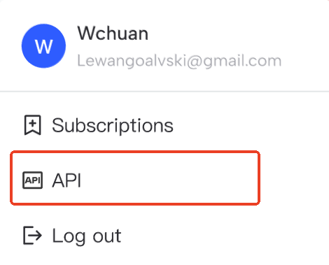
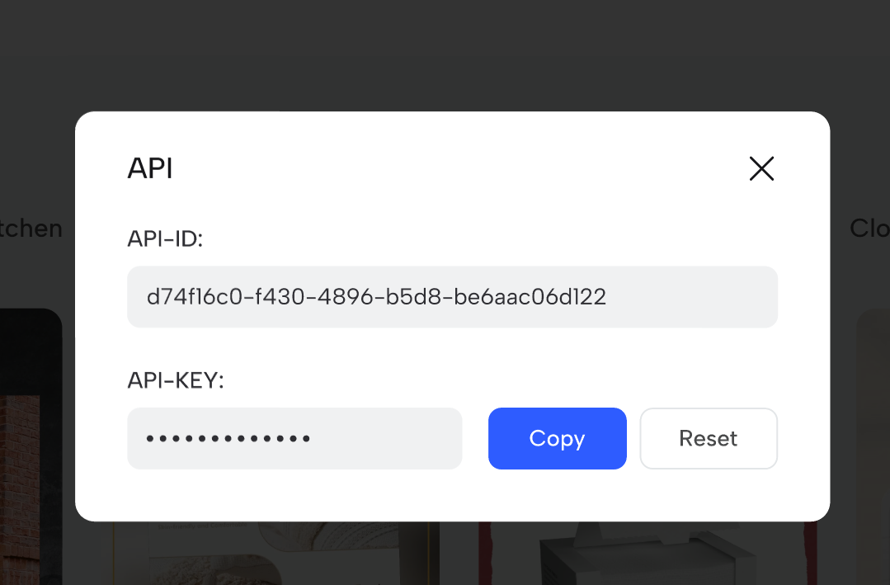
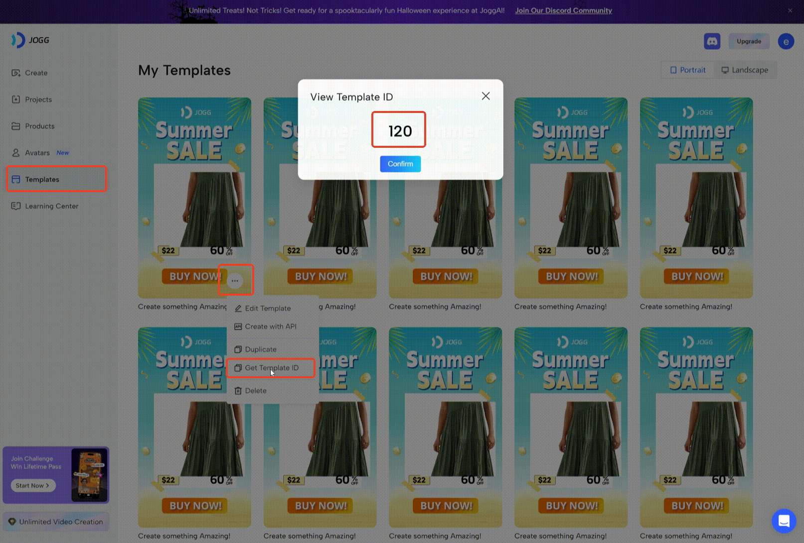
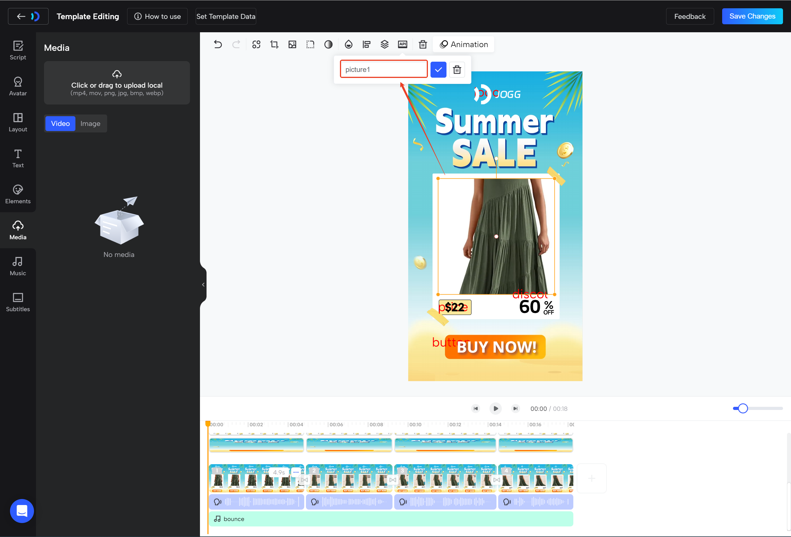
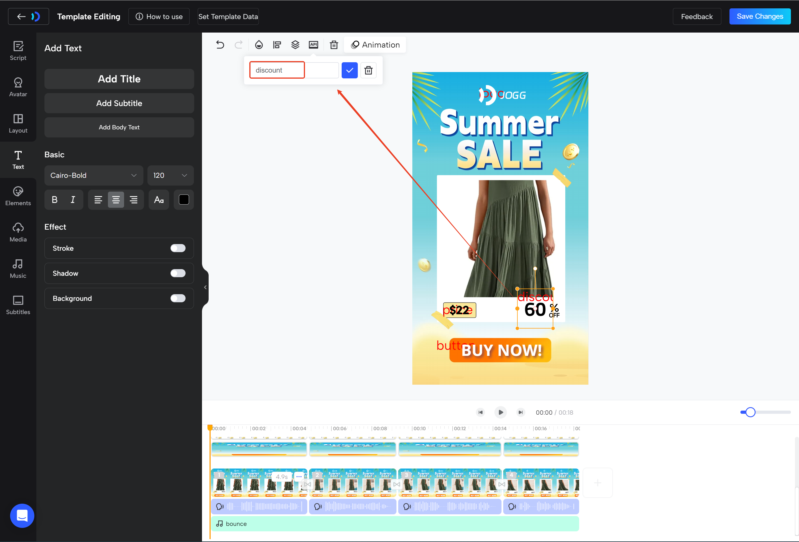
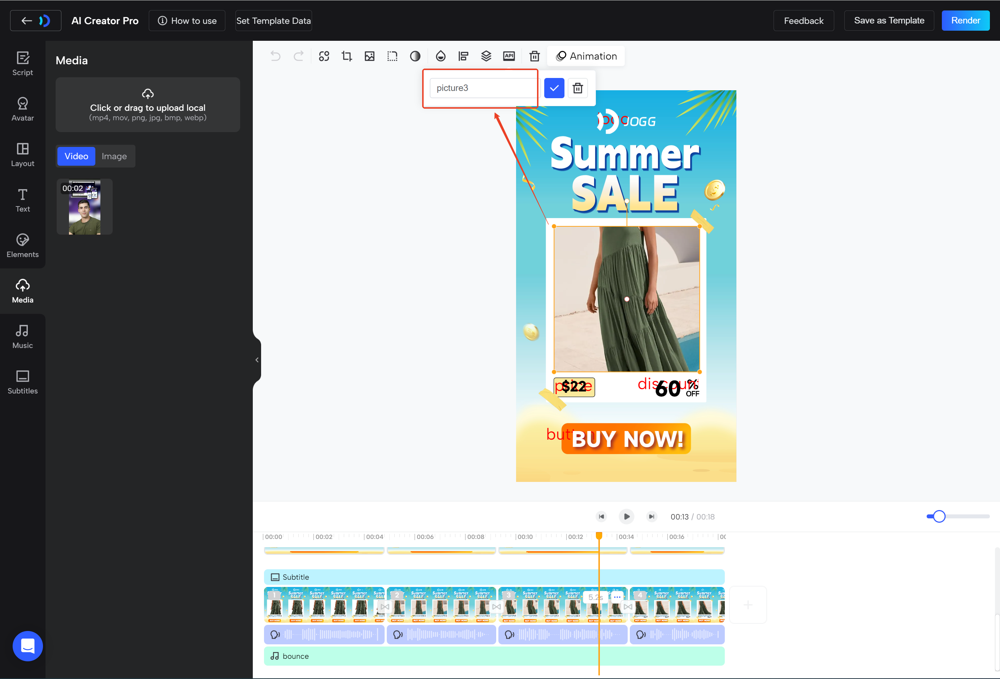

# 视频制作API文档

## 1. 应用模板生成视频 Create Video from Template

### 请求参数
```azure
{
    "text": "string",   # 文本script替换；默认为 "default"
    "lang": "string",   # 语言； "english" 英语
                                "filipino" 菲律宾语
                                "french" 法语
                                "german" 德语
                                "hindi" 印地语
                                "indonesian" 印度尼西亚语
                                "italian" 意大利语
                                "japanese" 日语
                                "korean" 韩语
                                "malay" 马来语
                                "portuguese" 葡萄牙语
                                "russian" 俄语
                                "spanish" 西班牙语
                                "thai" 泰语
                                "vietnamese" 越南语
                                "arabic" 阿拉伯语
                                "greek" 希腊语
                                "turkish" 土耳其语
                                "slovenian" 斯洛文尼亚语
                                "croatian" 克罗地亚语
                                "romanian" 罗马尼亚语
                                "chinese" 简体中文
                                "bengali" 孟加拉语
                                "urdu" 乌尔都语
                                "hungarian" 匈牙利语
                                "traditional-chinese" 繁体中文
                                "polish" 波兰语
    "template_id": 0,                # 模板ID
    "template_type": "string",       # 模板类型 默认为 "user";
    "dp_id": 0,                      # 数字人ID 默认为 0;
    "timbre_td": 0,                  #  音色ID 默认为0; 
    "without_tts": 0,                # 是否需要使用tts重做声音 0 需要 1不需要
    "variables": [                   # 变量替换数组; 
        {                            # type 变量类型：image 图片 video 视频 text 文本
            "name": "string",        # name 变量名称：模板页设置的待替换变量名
            "properties": {          # properties 变量属性
                "url": "string"      #      url     替换的图片/视频 URL
            },                       #      content 替换的文本信息
            "type": "string"
        }
    ]
}
```
### 返回
```azure
{
    "code": 0,
    "msg": "success",
    "data": {
        "prj_id": "620b079caf3a4d2abd2c7ce095fb4e69"    # 工程ID
    }
}
```
### 请求示例
```json
curl --location --request POST 'http://cmm-algo-jogg-backend-srv-dev.cds8.cn/open/render' 
--header 'x-api-key: <your-api-key>' 
--header 'Content-Type: application/json' 
--data-raw '{
    "text": "default",
    "lang": "english",
    "template_id": 96,
    "template_type": "user",
    "dp_id": 0,
    "timbre_td": 0,
    "without_tts": 1,
    "variables": [
        {
            "name": "logo",
            "properties": {
                "url": "https://jogg-test.cds8.cn/joggUserData/user/162/usermedia/56c09f69cc0e4e35b3eaa2666622773f.png"
            },
            "type": "image"
        },
        {
            "name": "discount",
            "properties": {
                "content": "66"
            },
            "type": "text"
        }
    ]
}'
```

### 获取 api_key


### 获取 template_id

### 选择模板中的待替换元素定义变量名称
选择图片进行替换

选择文本进行替换

选择视频进行替换



### 1.1 Replace Image in Template

#### 功能描述
- 在模板中替换图片。
```azure
curl --location --request POST 'http://cmm-algo-jogg-backend-srv-dev.cds8.cn/open/render' 
--header 'x-api-key: <your-api-key>' 
--header 'Content-Type: application/json' 
--data-raw '{
    "text": "default",
    "lang": "english",
    "template_id": 96,
    "template_type": "user",
    "dp_id": 0,
    "timbre_td": 0,
    "without_tts": 1,
    "variables": [
        {
            "name": "logo",
            "properties": {
                "url": "<your-image-url>"
            },
            "type": "image"
        }
    ]
}'
```

### 1.2 Replace Video in Template

#### 功能描述
- 在模板中替换视频片段。
```azure
curl --location --request POST 'http://cmm-algo-jogg-backend-srv-dev.cds8.cn/open/render' 
--header 'x-api-key: <your-api-key>' 
--header 'Content-Type: application/json' 
--data-raw '{
    "text": "default",
    "lang": "english",
    "template_id": 96,
    "template_type": "user",
    "dp_id": 0,
    "timbre_td": 0,
    "without_tts": 1,
    "variables": [
        {
            "name": "scene1",
            "properties": {
                "url": "<your-video-url>"
            },
            "type": "video"
        }
    ]
}'
```

### 1.3 Replace Avatar in Template

#### 功能描述
- 在模板中替换头像。
```azure
curl --location --request POST 'http://cmm-algo-jogg-backend-srv-dev.cds8.cn/open/render' 
--header 'x-api-key: <your-api-key>' 
--header 'Content-Type: application/json' 
--data-raw '{
    "text": "default",
    "lang": "english",
    "template_id": 96,
    "template_type": "user",
    "dp_id": 0,         #  设置对应的数字人ID
    "timbre_td": 0,
    "without_tts": 1,
    "variables": [
        {
            "name": "scene1",
            "properties": {
                "url": "<your-video-url>"
            },
            "type": "video"
        }
    ]
}'
```

### 1.4 Replace Text/Voice in Template

#### 功能描述
- 在模板中替换文字或语音。
```azure
curl --location --request POST 'http://cmm-algo-jogg-backend-srv-dev.cds8.cn/open/render' 
--header 'x-api-key: <your-api-key>' 
--header 'Content-Type: application/json' 
--data-raw '{
    "text": "default",      # 设置需要替换的script 当without_tts为0时有效
    "lang": "english",      # 设置需要替换的语言
    "template_id": 96,
    "template_type": "user",
    "dp_id": 0,     
    "timbre_td": 0,         # 设置需要替换的音色
    "without_tts": 1,
    "variables": [
        {
            "name": "scene1",
            "properties": {
                "url": "<your-video-url>"
            },
            "type": "video"
        }
    ]
}'
```