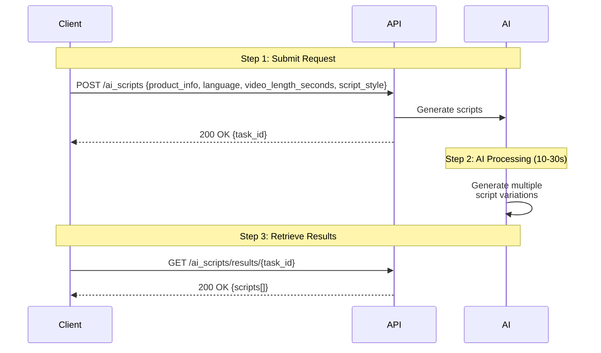

## Introduction

Generate professional marketing scripts automatically using JoggAI's AI. Provide product information or a topic, and get multiple script variations optimized for your video length and language.

### Key Features

<CardGroup cols={2}>
  <Card title="Auto-Generate" icon="wand-magic-sparkles">
    Create scripts from product info or descriptions
  </Card>
  <Card title="Multiple Styles" icon="sparkles">
    Get 3-5 script variations in different styles
  </Card>
  <Card title="Length Optimization" icon="clock">
    Scripts timed for 15/30/60 second videos
  </Card>
  <Card title="40+ Languages" icon="language">
    Generate scripts in any supported language
  </Card>
</CardGroup>

### Workflow Overview

AI script generation is a **3-step asynchronous process**:

<Steps>
  <Step title="Submit Request">
    Send product info and requirements to AI
  </Step>
  
  <Step title="AI Processing">
    AI generates multiple script options (10-30 seconds)
  </Step>
  
  <Step title="Retrieve & Select">
    Get generated scripts and choose your favorite
  </Step>
</Steps>



<Info>
AI script generation typically completes in **10-30 seconds**. You can start polling after 15 seconds.
</Info>

---

## Quick Start

### Related API Endpoints

| Endpoint | Purpose | Documentation |
|----------|---------|---------------|
| `POST /ai_scripts` | Submit script generation request | [API Reference](/api-reference/v2/Asset/CreateAIScript) |
| `GET /ai_scripts/results/{task_id}` | Get generated scripts | [API Reference](/api-reference/v2/Asset/GetAIScriptResult) |
| `POST /product` | Create product entry | [API Reference](/api-reference/v2/Product/CreateProduct) |

### Key Parameters

**Submit Request:**

| Parameter | Type | Required | Description |
|-----------|------|----------|-------------|
| `language` | string | ✅ | Script language (e.g., "english") |
| `video_length_seconds` | string | ✅ | "15", "30", or "60" seconds |
| `script_style` | string | ✅ | Script style: "Don't Worry", "Storytime", "Discovery", "Data", "Top 3 reasons", "Light marketing" |
| `product_info` | object | ✅ | Product information object |
| `product_info.source_type` | string | ✅ | "id" or "details" |
| `product_info.data` | object | ✅ | Product data based on source_type |
| `product_info.data.id` | string | * | Product ID (required when source_type is "id") |
| `product_info.data.name` | string | * | Product name (required when source_type is "details") |
| `product_info.data.description` | string | * | Product description (required when source_type is "details") |
| `target_audience` | string | ❌ | Target audience description (optional) |

**Response Fields:**

| Field | Type | Description |
|-------|------|-------------|
| `task_id` | string | Task ID from script generation request |
| `status` | string | pending/processing/completed/failed |
| `data` | object | Script generation results (only present when status is 'completed') |
| `data.generated_scripts` | array | Generated scripts in different styles |
| `data.generated_scripts[].script_style` | string | Style of the script (e.g., "Storytime", "Discovery") |
| `data.generated_scripts[].script_paragraphs` | array | The generated script content as an array of paragraphs |
| `err_msg` | string | Error message (only present when status is 'failed') |

---

## Code Examples

### Scenario 1: Generate Scripts from Product ID

Use an existing product to generate scripts:

**Step 1: Submit Request**

```bash
curl --request POST \
  --url 'https://api.jogg.ai/v2/ai_scripts' \
  --header 'x-api-key: YOUR_API_KEY' \
  --header 'Content-Type: application/json' \
  --data '{
    "language": "english",
    "video_length_seconds": "30",
    "script_style": "Storytime",
    "product_info": {
      "source_type": "id",
      "data": {
        "id": "NTQ0MTkzNjg"
      }
    }
  }'
```

**Response:**

```json
{
  "code": 0,
  "msg": "Success",
  "data": {
    "task_id": "task_123456789"
  }
}
```

<Check>
Save the `task_id` - you'll need it to retrieve your scripts!
</Check>

**Step 2: Retrieve Scripts (after 15-30 seconds)**

```bash
curl --request GET \
  --url 'https://api.jogg.ai/v2/ai_scripts/results/task_123456789' \
  --header 'x-api-key: YOUR_API_KEY'
```

**Response:**

```json
{
  "code": 0,
  "msg": "Success",
  "data": {
    "task_id": "task_123456789",
    "status": "completed",
    "data": {
      "generated_scripts": [
        {
          "script_style": "Storytime",
          "script_paragraphs": [
            "Ever tried drinking water while running?",
            "The Owala FreeSip bottle changes everything.",
            "Its unique spout lets you sip or swig - no spills, no fuss.",
            "Plus, it keeps drinks cold for 24 hours.",
            "Perfect for gym, work, or adventures!"
          ]
        },
        {
          "script_style": "Discovery",
          "script_paragraphs": [
            "Discover the Owala FreeSip - the water bottle that adapts to you.",
            "Sip through the straw or tilt to swig from the spout.",
            "Double-wall insulation keeps drinks ice-cold all day.",
            "Available in vibrant colors that match your style!"
          ]
        },
        {
          "script_style": "Top 3 reasons",
          "script_paragraphs": [
            "Three reasons to love the Owala FreeSip:",
            "One, the patented FreeSip spout for sipping or swigging.",
            "Two, 24-hour cold insulation.",
            "Three, leak-proof design for your bag.",
            "Upgrade your hydration game today!"
          ]
        }
      ]
    }
  }
}
```

---

### Scenario 2: Generate Scripts without Product ID

Provide product details directly:

```bash
curl --request POST \
  --url 'https://api.jogg.ai/v2/ai_scripts' \
  --header 'x-api-key: YOUR_API_KEY' \
  --header 'Content-Type: application/json' \
  --data '{
    "language": "english",
    "video_length_seconds": "30",
    "script_style": "Discovery",
    "product_info": {
      "source_type": "details",
      "data": {
        "name": "Premium Yoga Mat",
        "description": "Eco-friendly yoga mat with superior grip and cushioning. Made from natural rubber with moisture-wicking surface. 6mm thickness provides excellent support."
      }
    },
    "target_audience": "Yoga enthusiasts and fitness lovers"
  }'
```

---

### Scenario 3: Short 15-Second Scripts

Generate punchy scripts for quick social media videos:

```bash
curl --request POST \
  --url 'https://api.jogg.ai/v2/ai_scripts' \
  --header 'x-api-key: YOUR_API_KEY' \
  --header 'Content-Type: application/json' \
  --data '{
    "language": "english",
    "video_length_seconds": "15",
    "script_style": "Light marketing",
    "product_info": {
      "source_type": "id",
      "data": {
        "id": "NTQ0MTkzNjg"
      }
    }
  }'
```

**Sample 15-Second Script Response:**

```json
{
  "code": 0,
  "msg": "Success",
  "data": {
    "task_id": "task_123456789",
    "status": "completed",
    "data": {
      "generated_scripts": [
        {
          "script_style": "Light marketing",
          "script_paragraphs": [
            "Meet the Owala FreeSip - your new hydration hero!",
            "Sip or swig with one spout.",
            "Stays cold for 24 hours.",
            "Get yours today!"
          ]
        }
      ]
    }
  }
}
```

---

### Scenario 4: Multi-Language Scripts

Generate scripts in different languages:

```bash
curl --request POST \
  --url 'https://api.jogg.ai/v2/ai_scripts' \
  --header 'x-api-key: YOUR_API_KEY' \
  --header 'Content-Type: application/json' \
  --data '{
    "language": "spanish",
    "video_length_seconds": "30",
    "script_style": "Storytime",
    "product_info": {
      "source_type": "id",
      "data": {
        "id": "NTQ0MTkzNjg"
      }
    }
  }'
```

**Spanish Script Example:**

```json
{
  "code": 0,
  "msg": "Success",
  "data": {
    "task_id": "task_123456789",
    "status": "completed",
    "data": {
      "generated_scripts": [
        {
          "script_style": "Storytime",
          "script_paragraphs": [
            "¿Alguna vez intentaste beber agua mientras corres?",
            "La botella Owala FreeSip lo cambia todo.",
            "Su boquilla única te permite sorber o tragar - sin derrames, sin problemas.",
            "Además, mantiene las bebidas frías durante 24 horas.",
            "¡Perfecto para el gimnasio, trabajo o aventuras!"
          ]
        }
      ]
    }
  }
}
```

<Tip>
Supported languages include: English, Spanish, French, German, Japanese, Korean, Chinese, Portuguese, and 30+ more. See full list in the [API Reference](/api-reference/v2/Asset/CreateAIScript).
</Tip>

---

### Scenario 5: Check Generation Status

Poll to check if scripts are ready:

```bash
curl --request GET \
  --url 'https://api.jogg.ai/v2/ai_scripts/results/task_123456789' \
  --header 'x-api-key: YOUR_API_KEY'
```

**Response (Still Processing):**

```json
{
  "code": 0,
  "msg": "Success",
  "data": {
    "task_id": "task_123456789",
    "status": "processing"
  }
}
```

**Response (Completed):**

```json
{
  "code": 0,
  "msg": "Success",
  "data": {
    "task_id": "task_123456789",
    "status": "completed",
    "data": {
      "generated_scripts": [...]
    }
  }
}
```

**Response (Failed):**

```json
{
  "code": 0,
  "msg": "Success",
  "data": {
    "task_id": "task_123456789",
    "status": "failed",
    "err_msg": "Failed to generate script"
  }
}
```

---

## Script Style Guide

Understanding different script styles:

| Style | Characteristics | Best For |
|-------|----------------|----------|
| **Storytime** | Narrative, engaging, conversational | Products with a journey or transformation |
| **Discovery** | Exciting, exploratory, unveiling | New or innovative products |
| **Don't Worry** | Reassuring, problem-solving | Products that solve pain points |
| **Data** | Factual, statistics-driven | Tech products, B2B |
| **Top 3 Reasons** | Clear, structured, benefit-focused | Feature-rich products |
| **Light Marketing** | Friendly, promotional, upbeat | General products, e-commerce |

<Info>
The AI automatically generates scripts in multiple styles so you can choose the best fit for your brand and audience.
</Info>

---

## Use Case Examples

<AccordionGroup>
  <Accordion title="E-commerce Product Descriptions">
    Convert product pages into video scripts:
    - Use existing product IDs
    - Generate in multiple languages for global markets
    - Create variations for A/B testing
    - Batch process entire catalog
  </Accordion>
  
  <Accordion title="Social Media Content">
    Create engaging scripts for social platforms:
    - Use 15-second scripts for TikTok/Reels
    - Try "Storytime" or "Discovery" styles
    - Generate in target market languages
    - Produce multiple versions weekly
  </Accordion>
  
  <Accordion title="Ad Campaign Copy">
    Generate ad scripts quickly:
    - Test different messaging angles
    - Create urgency with "Don't Worry" style
    - Use "Top 3 Reasons" for clarity
    - Localize for different regions
  </Accordion>
  
  <Accordion title="Content Marketing">
    Scale video content production:
    - Generate scripts for product series
    - Create educational content
    - Produce weekly tips and tricks
    - Maintain consistent messaging
  </Accordion>
</AccordionGroup>

---

## Best Practices

### Script Selection

When choosing from multiple generated scripts:

1. **Match Your Brand Voice**: Select style that aligns with brand personality
2. **Know Your Audience**: "Data" style for B2B, "Storytime" for consumers
3. **Consider Platform**: Shorter, punchier scripts for social media
4. **Test Different Styles**: A/B test to find what resonates

### Optimization Tips

<Tip>
- **Be specific** with product descriptions for better results
- **Include key features** you want highlighted
- **Specify target audience** for appropriate tone
- **Generate multiple** times if not satisfied
</Tip>

---

## Related Documentation

<CardGroup cols={2}>
  <Card
    title="Create Product"
    icon="box"
    href="/api-reference/v2/Product/CreateProduct"
  >
    Create product entries first
  </Card>
  
  <Card
    title="Avatar Videos"
    icon="user"
    href="/api-reference/v2/API%20Documentation/CreateAvatarVideos"
  >
    Use scripts in avatar videos
  </Card>
  
  <Card
    title="Product Videos"
    icon="video"
    href="/api-reference/v2/API%20Documentation/URLtoVideo"
  >
    Generate videos with AI scripts
  </Card>
  
  <Card
    title="Webhook Integration"
    icon="webhook"
    href="/api-reference/v2/API%20Documentation/WebhookIntegration"
  >
    Automate script generation
  </Card>
</CardGroup>

---

## Troubleshooting

<AccordionGroup>
  <Accordion title="Scripts are too generic">
    **Solution:**
    - Provide more detailed product descriptions
    - Include specific features and benefits
    - Specify target audience clearly
    - Add unique selling points
  </Accordion>
  
  <Accordion title="Wrong language or tone">
    **Solution:**
    - Verify `language` parameter is correct
    - Try different `script_style` options
    - Provide `target_audience` description
    - Add context about brand personality in product description
  </Accordion>
  
  <Accordion title="Task stays in processing">
    **Solution:**
    - Wait up to 60 seconds before retry
    - Check task_id is correct
    - Verify API key permissions
    - Contact support if persists > 2 minutes
  </Accordion>
</AccordionGroup>
