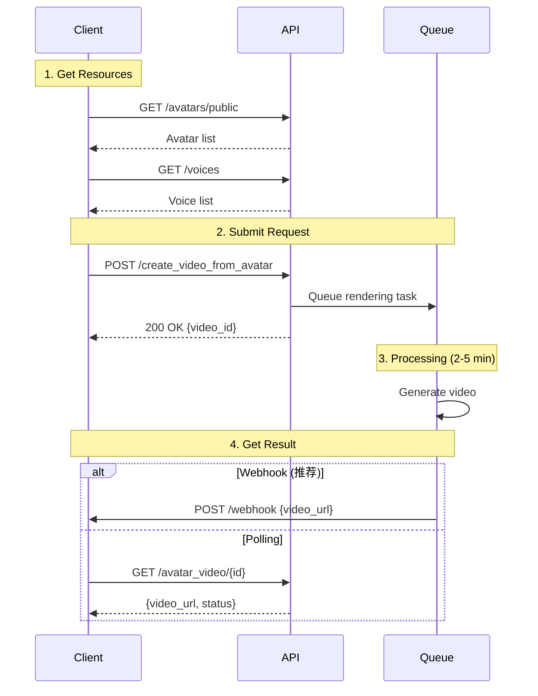

## Introduction

Create engaging talking avatar videos with the JoggAI API. Select from 100+ realistic avatars, provide your script or audio, and generate professional videos in minutes.

### Key Features

<CardGroup cols={2}>
  <Card title="100+ Avatars" icon="user">
    Professional avatars across all demographics
  </Card>
  <Card title="40+ Languages" icon="language">
    Natural text-to-speech in multiple languages
  </Card>
  <Card title="Fast Generation" icon="bolt">
    Videos ready in 2-5 minutes
  </Card>
  <Card title="Custom Options" icon="sliders">
    Control background, aspect ratio, and captions
  </Card>
</CardGroup>

### Workflow Overview

Avatar video creation is an **asynchronous 4-step process**:

<Steps>
  <Step title="Get Resources">
    Retrieve available avatars and voices from the API
  </Step>
  
  <Step title="Submit Video Request">
    Call create endpoint with avatar, voice, and script/audio
  </Step>
  
  <Step title="Background Processing">
    Video renders automatically (2-5 minutes)
  </Step>
  
  <Step title="Retrieve Result">
    Get video URL via webhook or polling
  </Step>
</Steps>



<Info>
This is an asynchronous process. Don't wait for the response - use webhooks or polling to get results.
</Info>

---

## Quick Start

### Related API Endpoints

| Endpoint | Purpose | Documentation |
|----------|---------|---------------|
| `GET /avatars/public` | Get public avatar list | [API Reference](/api-reference/v2/Avatar/GetPublicAvatars) |
| `GET /voices` | Get voice list | [API Reference](/api-reference/v2/Voice/GetVoices) |
| `POST /create_video_from_avatar` | Create avatar video | [API Reference](/api-reference/v2/Video/CreateVideoFromAvatar) |
| `GET /avatar_video/{id}` | Check video status | [API Reference](/api-reference/v2/Video/GetAvatarVideo) |

### Key Parameters

| Parameter | Type | Required | Description |
|-----------|------|----------|-------------|
| `avatar_id` | integer | ✅ | Avatar ID from avatar list |
| `avatar_type` | integer | ✅ | 0=Public, 1=Custom avatar |
| `voice_id` | string | ✅ | Voice ID for text-to-speech |
| `script` | string | * | Text to speak (required if no audio_url) |
| `audio_url` | string | * | Audio file URL (required if no script) |
| `aspect_ratio` | string | ✅ | portrait/landscape/square |
| `screen_style` | integer | ✅ | 1=Background, 2=Green screen, 3=WebM |
| `caption` | boolean | ❌ | Enable subtitles (default: false) |

<Warning>
You must provide either `script` (for text-to-speech) OR `audio_url` (for custom audio), but not both.
</Warning>

---

## Code Examples

### Scenario 1: Basic Avatar Video with Script

Create a simple video with text-to-speech:

```bash
curl --request POST \
  --url 'https://api.jogg.ai/open/v2/create_video_from_avatar' \
  --header 'x-api-key: YOUR_API_KEY' \
  --header 'Content-Type: application/json' \
  --data '{
    "avatar_id": 81,
    "avatar_type": 0,
    "voice_id": "en-US-ChristopherNeural",
    "script": "Welcome to JoggAI! Create amazing videos with AI avatars in minutes.",
    "aspect_ratio": "portrait",
    "screen_style": 1,
    "caption": true
  }'
```

**Response:**

```json
{
  "code": 0,
  "msg": "Success",
  "data": {
    "video_id": "video_123456"
  }
}
```

<Check>
Save the `video_id` to check status later!
</Check>

---

### Scenario 2: Avatar Video with Custom Audio

Use your own audio file instead of text-to-speech:

```bash
curl --request POST \
  --url 'https://api.jogg.ai/open/v2/create_video_from_avatar' \
  --header 'x-api-key: YOUR_API_KEY' \
  --header 'Content-Type: application/json' \
  --data '{
    "avatar_id": 81,
    "avatar_type": 0,
    "voice_id": "en-US-ChristopherNeural",
    "audio_url": "https://res.jogg.ai/my-audio.mp3",
    "aspect_ratio": "landscape",
    "screen_style": 1,
    "caption": false
  }'
```

**Response:**

```json
{
  "code": 0,
  "msg": "Success",
  "data": {
    "video_id": "video_789012"
  }
}
```

<Tip>
Upload audio files using the [Upload Asset](/api-reference/v2/Asset/UploadAsset) endpoint first.
</Tip>

---

### Scenario 3: Transparent Background (Green Screen)

Create video with green screen for easy compositing:

```bash
curl --request POST \
  --url 'https://api.jogg.ai/open/v2/create_video_from_avatar' \
  --header 'x-api-key: YOUR_API_KEY' \
  --header 'Content-Type: application/json' \
  --data '{
    "avatar_id": 81,
    "avatar_type": 0,
    "voice_id": "en-US-ChristopherNeural",
    "script": "Green screen demo for video editing",
    "aspect_ratio": "square",
    "screen_style": 2,
    "caption": false
  }'
```

**Response:**

```json
{
  "code": 0,
  "msg": "Success",
  "data": {
    "video_id": "video_345678"
  }
}
```

<Info>
`screen_style: 2` creates a green screen background for easy editing in tools like Adobe Premiere or Final Cut Pro.
</Info>

---

### Scenario 4: Check Video Status

Poll to check if video is ready:

```bash
curl --request GET \
  --url 'https://api.jogg.ai/open/v2/avatar_video/video_123456' \
  --header 'x-api-key: YOUR_API_KEY'
```

**Response (Processing):**

```json
{
  "code": 0,
  "msg": "Success",
  "data": {
    "id": "video_123456",
    "status": "processing",
    "created_at": 1732806631
  }
}
```

**Response (Completed):**

```json
{
  "code": 0,
  "msg": "Success",
  "data": {
    "id": "video_123456",
    "status": "completed",
    "video_url": "https://res.jogg.ai/videos/video_123456.mp4",
    "cover_url": "https://res.jogg.ai/covers/cover_123456.jpg",
    "duration": 30,
    "created_at": 1732806631
  }
}
```

<Tip>
Instead of polling, use [Webhooks](/api-reference/v2/API Documentation/WebhookIntegration) to get notified instantly when videos are ready!
</Tip>

---

## Use Case Examples

<AccordionGroup>
  <Accordion title="Marketing & Social Media">
    Create engaging marketing videos for social platforms:
    - Use `aspect_ratio: "portrait"` for Instagram Stories/TikTok
    - Use `aspect_ratio: "landscape"` for YouTube
    - Enable `caption: true` for silent autoplay
  </Accordion>
  
  <Accordion title="E-Learning & Training">
    Generate educational content with AI presenters:
    - Choose professional avatars for credibility
    - Use clear, structured scripts
    - Add captions for accessibility
  </Accordion>
  
  <Accordion title="Product Demos">
    Showcase products with avatar presenters:
    - Use custom audio for brand voice
    - Combine with product visuals
    - Generate videos in multiple languages
  </Accordion>
  
  <Accordion title="Customer Support">
    Create FAQ and tutorial videos:
    - Batch generate common questions
    - Update easily by regenerating
    - Personalize with voice selection
  </Accordion>
</AccordionGroup>

---

## Related Documentation

<CardGroup cols={2}>
  <Card
    title="Avatar List API"
    icon="users"
    href="/api-reference/v2/Avatar/GetPublicAvatars"
  >
    Browse available avatars
  </Card>
  
  <Card
    title="Voice List API"
    icon="microphone"
    href="/api-reference/v2/Voice/GetVoices"
  >
    Explore voice options
  </Card>
  
  <Card
    title="Upload Audio"
    icon="upload"
    href="/api-reference/v2/Asset/UploadAsset"
  >
    Upload custom audio files
  </Card>
  
  <Card
    title="Webhook Setup"
    icon="webhook"
    href="/api-reference/v2/API Documentation/WebhookIntegration"
  >
    Get instant notifications
  </Card>
</CardGroup>

