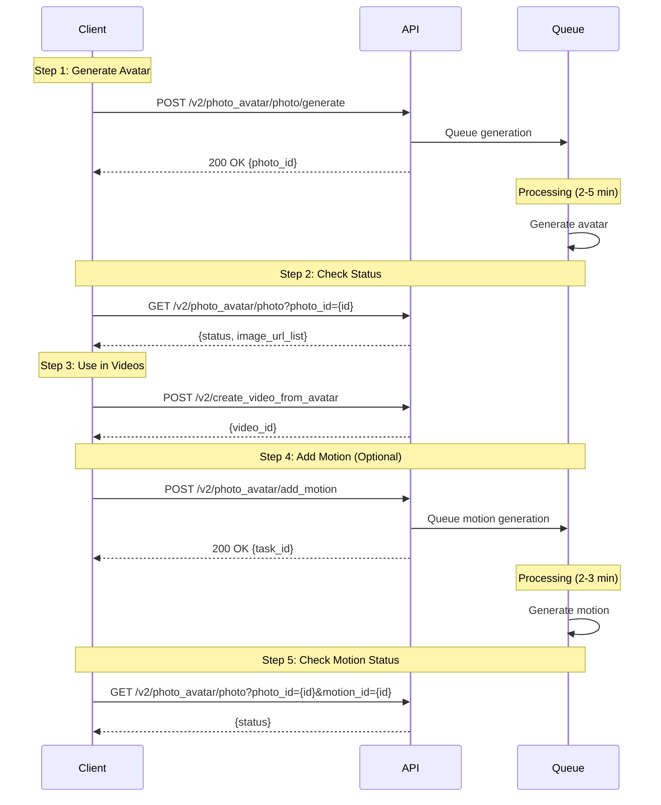

## Introduction

Transform portrait photos into talking AI avatars that can speak any script in 40+ languages. Create personalized avatars for branding, marketing, or custom content production. Photo avatars allow you to use your own face or team members' faces in videos, maintaining brand consistency across all content.

### Key Features

<CardGroup cols={2}>
  <Card title="Personal Branding" icon="user-tie">
    Your face, your voice, your brand
  </Card>
  <Card title="Multilingual" icon="globe">
    One photo avatar speaks 40+ languages
  </Card>
  <Card title="Realistic Motion" icon="video">
    Natural facial expressions and movements
  </Card>
  <Card title="Fast Generation" icon="bolt">
    2-5 minutes to create custom avatar
  </Card>
</CardGroup>

### Workflow Overview

Photo avatar creation follows these steps:

<Steps>
  <Step title="Generate Avatar">
    Upload portrait photo → AI generates avatar (2-5 min)
  </Step>

  <Step title="Check Status">
    Poll for completion or use webhooks
  </Step>

  <Step title="Use in Videos">
    Create videos using your custom avatar
  </Step>

  <Step title="Add Motion (Optional)">
    Enhance avatar with realistic movements (2-3 min)
  </Step>
</Steps>



<Info>
**Optional Step:** Add motion for enhanced realism (additional 2-3 minutes). See [Step 4: Add Motion to Avatar](#step-4-add-motion-to-avatar-optional) section below.
</Info>

---

## Quick Start

### Related API Endpoints

| Endpoint | Purpose | Documentation |
|----------|---------|---------------|
| `POST /v2/photo_avatar/photo/generate` | Generate photo avatar | [API Reference](/api-reference/v2/Avatar/PhotoAvatarGenerate) |
| `GET /v2/photo_avatar/photo?photo_id={id}` | Check generation status | [API Reference](/api-reference/v2/Avatar/PhotoAvatarStatusGet) |
| `GET /v2/avatars/photo_avatars` | List your photo avatars | [API Reference](/api-reference/v2/Avatar/PhotoAvatarsGet) |
| `POST /v2/photo_avatar/add_motion` | Add motion to avatar | [API Reference](/api-reference/v2/Avatar/PhotoAvatarMotionAdd) |

### Key Parameters

| Parameter | Type | Required | Description |
|-----------|------|----------|-------------|
| `age` | string | ✅ | Avatar age group: "Teenager", "Young adult", "Adult", "Elderly" |
| `avatar_style` | string | ✅ | Style category: "Professional", "Social" |
| `gender` | string | ✅ | Avatar gender: "Female", "Male" |
| `model` | string | ✅ | Photo generation model: "classic", "modern" |
| `aspect_ratio` | string | ✅ | Photo aspect ratio: "portrait", "landscape", "square" |
| `image_url` | string | ❌ | Reference image URL (your portrait photo) |
| `ethnicity` | string | ❌ | Avatar ethnicity (optional) |
| `background` | string | ❌ | Background description |
| `appearance` | string | ❌ | Appearance description |

<Warning>
**Photo Requirements:** Use high-quality portrait photos (min 512x512px, recommended 1024x1024px). Face should be frontal, well-lit, and unobstructed. See [Photo Requirements](#photo-requirements) section for details.
</Warning>

---

## Code Examples

### Scenario 1: Basic Photo Avatar Creation

Create and use a photo avatar in videos:

#### Step 1: Generate Photo Avatar

Generate a custom avatar from your portrait photo:

```bash
curl --request POST \
  --url 'https://api.jogg.ai/v2/photo_avatar/photo/generate' \
  --header 'x-api-key: YOUR_API_KEY' \
  --header 'Content-Type: application/json' \
  --data '{
    "age": "Adult",
    "avatar_style": "Professional",
    "gender": "Male",
    "model": "modern",
    "aspect_ratio": "portrait",
    "image_url": "https://example.com/portrait.jpg"
  }'
```

**Response:**

```json
{
  "code": 0,
  "msg": "Success",
  "data": {
    "photo_id": "photo_abc123"
  }
}
```

<Check>
Save the `photo_id` to check generation status!
</Check>

---

#### Step 2: Check Generation Status

Check if avatar generation is complete:

```bash
curl --request GET \
  --url 'https://api.jogg.ai/v2/photo_avatar/photo?photo_id=photo_abc123' \
  --header 'x-api-key: YOUR_API_KEY'
```

**Response (Processing):**

```json
{
  "code": 0,
  "msg": "Success",
  "data": {
    "photo_id": "photo_abc123",
    "status": "in_progress"
  }
}
```

**Response (Completed):**

```json
{
  "code": 0,
  "msg": "Success",
  "data": {
    "photo_id": "photo_abc123",
    "status": "success",
    "image_url_list": [
      "https://res.jogg.ai/avatars/photo_abc123_1.jpg",
      "https://res.jogg.ai/avatars/photo_abc123_2.jpg"
    ],
    "image_key_list": ["key1", "key2"]
  }
}
```

<Tip>
Avatar generation typically takes 2-5 minutes. Use [Webhooks](/api-reference/v2/API%20Documentation/WebhookIntegration) for instant notifications instead of polling.
</Tip>

---

#### Step 3: Create Video with Photo Avatar

Create a video using your photo avatar:

```bash
curl --request POST \
  --url 'https://api.jogg.ai/v2/create_video_from_avatar' \
  --header 'x-api-key: YOUR_API_KEY' \
  --header 'Content-Type: application/json' \
  --data '{
    "avatar": {
      "avatar_id": 123,
      "avatar_type": 1
    },
    "voice": {
      "type": "script",
      "voice_id": "en-US-ChristopherNeural",
      "script": "Hello! I am your custom photo avatar."
    },
    "aspect_ratio": "portrait",
    "screen_style": 1,
    "caption": true
  }'
```

**Response:**

```json
{
  "code": 0,
  "msg": "Success",
  "data": {
    "video_id": "video_123456"
  }
}
```

<Warning>
**Important:** Always use `avatar_type: 1` for photo avatars (custom avatars). Use `avatar_type: 0` for public avatars.
</Warning>

---

### Scenario 2: Photo Avatar with Motion Enhancement

Create a photo avatar with enhanced motion for more realistic videos:

#### Step 1: Generate Photo Avatar

Generate a custom avatar from your portrait photo:

```bash
curl --request POST \
  --url 'https://api.jogg.ai/v2/photo_avatar/photo/generate' \
  --header 'x-api-key: YOUR_API_KEY' \
  --header 'Content-Type: application/json' \
  --data '{
    "age": "Adult",
    "avatar_style": "Professional",
    "gender": "Male",
    "model": "modern",
    "aspect_ratio": "portrait",
    "image_url": "https://example.com/portrait.jpg"
  }'
```

**Response:**

```json
{
  "code": 0,
  "msg": "Success",
  "data": {
    "photo_id": "photo_abc123"
  }
}
```

---

#### Step 2: Check Generation Status

Check if avatar generation is complete:

```bash
curl --request GET \
  --url 'https://api.jogg.ai/v2/photo_avatar/photo?photo_id=photo_abc123' \
  --header 'x-api-key: YOUR_API_KEY'
```

**Response (Completed):**

```json
{
  "code": 0,
  "msg": "Success",
  "data": {
    "photo_id": "photo_abc123",
    "status": "success",
    "image_url_list": [
      "https://res.jogg.ai/avatars/photo_abc123_1.jpg",
      "https://res.jogg.ai/avatars/photo_abc123_2.jpg"
    ],
    "image_key_list": ["key1", "key2"]
  }
}
```

---

#### Step 3: Add Motion to Avatar

Enhance avatar with realistic movements:

```bash
curl --request POST \
  --url 'https://api.jogg.ai/v2/photo_avatar/add_motion' \
  --header 'x-api-key: YOUR_API_KEY' \
  --header 'Content-Type: application/json' \
  --data '{
    "avatar_id": 123,
    "motion_type": "natural"
  }'
```

**Response:**

```json
{
  "code": 0,
  "msg": "Success",
  "data": {
    "task_id": "motion_xyz789",
    "status": "processing",
    "estimated_time": 150
  }
}
```

<Check>
Save the `task_id` to check motion generation status!
</Check>

---

#### Step 4: Check Motion Status

Check if motion generation is complete:

```bash
curl --request GET \
  --url 'https://api.jogg.ai/v2/photo_avatar/photo?photo_id=photo_abc123&motion_id=motion_xyz789' \
  --header 'x-api-key: YOUR_API_KEY'
```

<Tip>
Motion generation adds 2-3 minutes but significantly improves avatar realism and natural movement.
</Tip>

---

#### Step 5: Create Video with Enhanced Avatar

Create a video using your photo avatar with motion:

```bash
curl --request POST \
  --url 'https://api.jogg.ai/v2/create_video_from_avatar' \
  --header 'x-api-key: YOUR_API_KEY' \
  --header 'Content-Type: application/json' \
  --data '{
    "avatar": {
      "avatar_id": 123,
      "avatar_type": 1
    },
    "voice": {
      "type": "script",
      "voice_id": "en-US-ChristopherNeural",
      "script": "Hello! I am your custom photo avatar with enhanced motion."
    },
    "aspect_ratio": "portrait",
    "screen_style": 1,
    "caption": true
  }'
```

**Response:**

```json
{
  "code": 0,
  "msg": "Success",
  "data": {
    "video_id": "video_123456"
  }
}
```

<Warning>
**Important:** Always use `avatar_type: 1` for photo avatars (custom avatars). Use `avatar_type: 0` for public avatars.
</Warning>

---

## Advanced Examples

### Scenario 1: List Your Photo Avatars

Get all your photo avatars:

```bash
curl --request GET \
  --url 'https://api.jogg.ai/v2/avatars/photo_avatars' \
  --header 'x-api-key: YOUR_API_KEY'
```

**Response:**

```json
{
  "code": 0,
  "msg": "Success",
  "data": {
    "avatars": [
      {
        "id": 123,
        "name": "My Photo Avatar",
        "cover_url": "https://res.jogg.ai/avatars/cover_123.jpg",
        "status": 1,
        "fail_msg": ""
      }
    ]
  }
}
```

<Info>
Status values: `0` = Processing, `1` = Completed, `2` = Failed. Save the `id` (integer) to use in video creation.
</Info>

---

## Photo Requirements

### Image Specifications

| Requirement | Specification |
|-------------|---------------|
| **Format** | JPG, PNG, WebP |
| **File Size** | Maximum 10MB |
| **Resolution** | Min: 512x512px, Recommended: 1024x1024px |
| **Aspect Ratio** | Square or portrait |
| **Face** | Clear, frontal, well-lit, unobstructed |

### Photo Quality Guidelines

<AccordionGroup>
  <Accordion title="✅ Good Photos">
    **What works best:**
    
    - Face directly facing camera (frontal view)
    - Even, soft lighting (no harsh shadows)
    - Clear facial features (high resolution)
    - Neutral or slight smile expression
    - Plain, solid-color background
    - Natural makeup and appearance
    - No glasses (or non-reflective if needed)
    - Hair not covering face
  </Accordion>
  
  <Accordion title="❌ Avoid These">
    **What doesn't work:**
    
    - Side profile or angled face
    - Poor lighting or harsh shadows
    - Blurry or low-resolution images
    - Face obstructed (hands, objects, masks)
    - Busy or cluttered backgrounds
    - Sunglasses or reflective glasses
    - Hats or head coverings
    - Extreme expressions (laughing, frowning)
    - Heavy filters or editing
  </Accordion>
  
  <Accordion title="Lighting Tips">
    **Best lighting setup:**
    
    - Natural outdoor light (overcast day is ideal)
    - Soft indoor lighting (no overhead harsh lights)
    - Face evenly lit (no one-sided shadows)
    - Avoid backlit photos (light behind subject)
    - Use diffused light when possible
    - Golden hour for outdoor photos
  </Accordion>
  
  <Accordion title="Background Recommendations">
    **Background best practices:**
    
    - Plain, solid color works best
    - White, gray, or neutral tones
    - Good contrast with subject
    - No distracting elements
    - Avoid patterns or textures
    - Professional backdrop preferred
  </Accordion>
</AccordionGroup>

---

## Use Case Examples

<AccordionGroup>
  <Accordion title="Personal Branding">
    Create your digital spokesperson:
    - **Social Media**: Personalized video messages at scale
    - **Email Marketing**: Custom video intros
    - **Online Courses**: Instructor presence without recording
    - **Thought Leadership**: Consistent personal brand across content
  </Accordion>
  
  <Accordion title="Company Spokesperson">
    Feature executives or team members:
    - **Announcements**: CEO messages in multiple languages
    - **Product Demos**: Consistent company voice
    - **Training Videos**: Scale expert knowledge
    - **Customer Support**: Personalized video responses
  </Accordion>
  
  <Accordion title="Multilingual Content">
    One photo, many languages:
    - Create avatar once from photo
    - Generate videos in 40+ languages
    - Maintain same face across all markets
    - No need for multiple recordings
  </Accordion>
</AccordionGroup>

---

## Tips for Best Results

<Tip>
**Photo Preparation:**
- Use professional headshots or high-quality smartphone photos
- Studio or natural outdoor lighting works best
- Sharp focus, no blur
- No filters or heavy editing
- Natural skin tones
</Tip>

**Testing Strategy:**
- Test with one photo first
- Generate video with short script
- Verify avatar quality and movements
- Test different voices and languages
- Adjust source photo if needed

**Organization:**
- Use descriptive names for avatars
- Document avatar IDs for easy reference
- Note which photos work best
- Maintain source photo library
- Track motion settings used

**Avatar Type Reference:**

| Type | Value | Description | Use Case |
|------|-------|-------------|----------|
| **Public Avatar** | `0` | Pre-made library avatars | Quick, generic content |
| **Custom Avatar** | `1` | Photo avatars | Personal/branded content |

<Check>
Always use `avatar_type: 1` when creating videos with photo avatars.
</Check>

---

## Troubleshooting

<AccordionGroup>
  <Accordion title="Photo Quality Too Low">
    **Error:** `Photo quality insufficient`
    
    **Solutions:**
    - Use minimum 512x512px resolution (1024x1024px recommended)
    - Ensure image is sharp, not blurry
    - Use well-lit photo
    - Avoid heavily compressed images
    - Try professional headshot
  </Accordion>
  
  <Accordion title="Face Not Detected">
    **Error:** `No face detected in photo`
    
    **Solutions:**
    - Ensure face is clearly visible and frontal
    - Remove obstructions (hands, masks, hair)
    - Face should not be profile or angled
    - Check lighting and contrast
    - Ensure face occupies enough of frame
  </Accordion>
  
  <Accordion title="Generation Failed">
    **Error:** `Avatar generation failed`
    
    **Solutions:**
    - Try a different photo
    - Verify photo meets all requirements
    - Ensure photo URL is publicly accessible
    - Check file format is supported (JPG/PNG/WebP)
    - Verify file size is under 10MB
    - Retry the generation
  </Accordion>
  
  <Accordion title="Avatar Looks Unnatural">
    **Issue:** Generated avatar doesn't look realistic
    
    **Solutions:**
    - Use higher quality source photo
    - Ensure proper, even lighting
    - Use photo with neutral expression
    - Plain background helps AI focus on face
    - Consider professional headshot
    - Test with different photos
  </Accordion>
  
  <Accordion title="Motion Not Working">
    **Issue:** Motion generation fails or looks wrong
    
    **Solutions:**
    - Ensure base avatar generation completed first
    - Check avatar status is "completed" (status = 1)
    - Verify avatar quality is good
    - Try different `motion_type`
    - Re-generate avatar with better photo
  </Accordion>
</AccordionGroup>

---

## Related Documentation

<CardGroup cols={2}>
  <Card
    title="Avatar Videos with Photo Avatar"
    icon="video"
    href="/api-reference/v2/API%20Documentation/AvatarVideosWithPhotoAvatar"
  >
    Using photo avatars in videos
  </Card>
  
  <Card
    title="Create Avatar Videos"
    icon="user"
    href="/api-reference/v2/API%20Documentation/CreateAvatarVideos"
  >
    Main avatar video guide
  </Card>
  
  <Card
    title="Upload Media"
    icon="upload"
    href="/api-reference/v2/API%20Documentation/UploadMedia"
  >
    How to upload photos and media
  </Card>
  
  <Card
    title="Generate Photo Avatar API"
    icon="camera"
    href="/api-reference/v2/Avatar/PhotoAvatarGenerate"
  >
    Complete API reference
  </Card>
</CardGroup>
