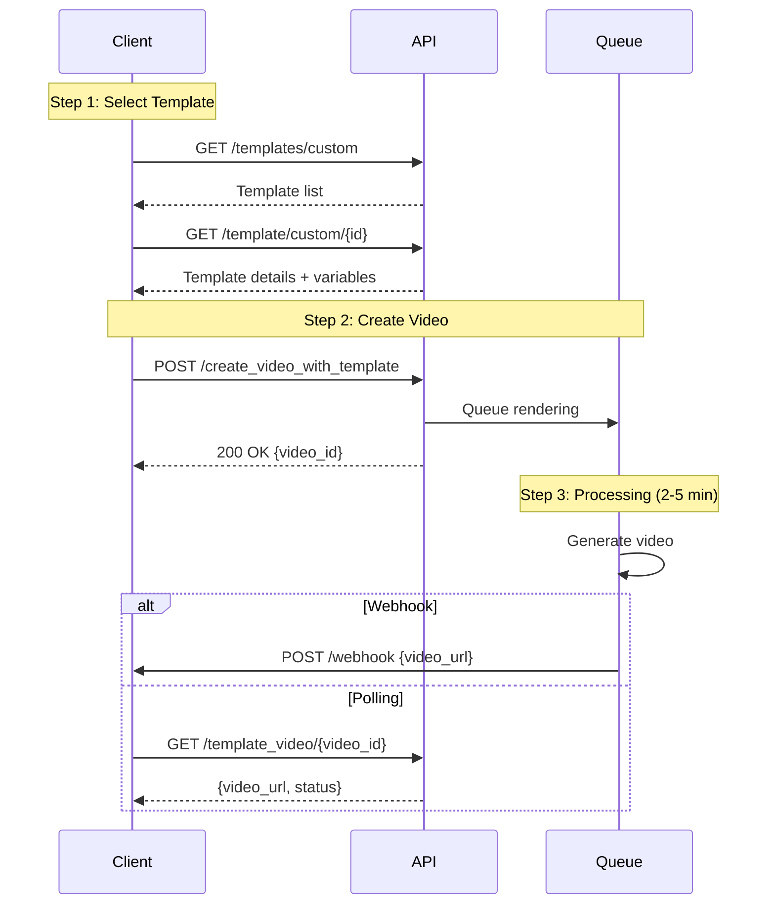

## Introduction

Use templates to create professional videos with consistent branding. Choose from JoggAI's template library or create custom templates with your own layout and design. Templates allow you to generate multiple videos quickly by simply changing variable values.

### Key Features

<CardGroup cols={2}>
  <Card title="Fast Creation" icon="bolt">
    Skip the design process with ready-made templates
  </Card>
  <Card title="Brand Consistency" icon="palette">
    Maintain consistent style across all videos
  </Card>
  <Card title="Batch Processing" icon="layer-group">
    Generate multiple videos with the same template
  </Card>
  <Card title="Flexible Variables" icon="sliders">
    Customize text, images, videos, and scripts
  </Card>
</CardGroup>

### Workflow Overview

Template video creation is a **4-step process**:

<Steps>
  <Step title="Create Template (One-time)">
    Design your template in the dashboard and define variables
  </Step>
  
  <Step title="Select Template">
    Browse and choose a template from your library
  </Step>
  
  <Step title="Customize Variables">
    Provide values for template variables (text, images, etc.)
  </Step>
  
  <Step title="Generate & Retrieve">
    Video renders in background, retrieve when complete
  </Step>
</Steps>



<Info>
Template videos typically take 2-5 minutes to generate. Use webhooks for best experience.
</Info>

---

## Creating Templates

Before using templates, you need to create your own templates. Templates allow you to define a fixed layout with replaceable variables for text, images, videos, scripts, and avatars.

### Step 1: Create Template in Dashboard

Create your own templates in the user interface. There are two types of templates: public library templates and custom templates created by you.

**To create a template:**

1. Log in to [app.jogg.ai](https://app.jogg.ai) and navigate to the Template Library section
2. Click "Create Template" and design your video layout
3. Once created, copy the `template_id` from the template card


<Info>
Templates can be created in the dashboard interface. You can design the layout, animations, background music, and define variables for customization.
</Info>

### Step 2: Define Variables in Template

In the template editor, define variables for elements you want to make replaceable:

**Supported Variable Types:**
- **Text**: Static text elements (titles, descriptions, labels)
- **Image**: Image placeholders (product photos, logos, backgrounds)
- **Video**: Video placeholders (background videos, product demos)
- **Script**: Script content for text-to-speech (spoken content)
- **Avatar**: Avatar selection (can be overridden per video)

**How to Define Variables:**

In the template editor, you can customize variable names for elements in the template to facilitate identification and replacement. Currently, only `script content, text, image, video and avatar` are supported.

1. Select an element in your template (text, image, video, or script)
2. Click "Set as Variable" or "Define Variable"
3. Enter a variable name (e.g., `product_name`, `product_image`, `script_en`)
4. Set the variable type (text, image, video, script, or avatar)
5. Mark as required or optional

**Example: Defining Text Variables**


**Example: Defining Media Variables (Image/Video)**


**Example: Defining Script Variables**


<Tip>
Use descriptive variable names that match your content structure. For example: `product_name`, `product_image`, `script_en`, `background_video`.
</Tip>

### Step 3: Get Template Details

After creating your template, you can view all defined variables in the template editor or get them via API. The template details will show all variables you've defined, including their names, types, and whether they're required.

<Check>
All variables defined in your template will be listed with their names and types. Use these exact variable names when creating videos from the template.
</Check>

---

## Quick Start

### Related API Endpoints

| Endpoint | Purpose | Documentation |
|----------|---------|---------------|
| `GET /v2/templates/custom` | List your custom templates | [API Reference](/api-reference/v2/Template/GetTemplates) |
| `GET /v2/template/custom/{id}` | Get template details | [API Reference](/api-reference/v2/Template/GetTemplateById) |
| `POST /v2/create_video_with_template` | Create video from template | [API Reference](/api-reference/v2/Video/CreateVideoWithTemplate) |
| `GET /v2/template_video/{video_id}` | Check video status | [API Reference](/api-reference/v2/Video/TemplateVideoGet) |

### Key Parameters

| Parameter | Type | Required | Description |
|-----------|------|----------|-------------|
| `template_id` | integer | ✅ | Template ID from template list |
| `variables` | array | ✅ | Template variables array (see Variable Types below) |
| `avatar_id` | integer | ❌ | Override template avatar |
| `avatar_type` | integer | ❌ | 0=Public, 1=Custom |
| `voice_language` | string | ✅ | Voice language for text-to-speech |
| `voice_id` | string | ❌ | Override template voice ID |
| `video_name` | string | ❌ | Custom name for the video |
| `captions_enabled` | boolean | ❌ | Enable subtitles (default: false) |
| `webhook_url` | string | ❌ | Webhook URL for status notifications |

<Warning>
**Variables Required:** All required variables from the template must be provided in the `variables` array. Get template details first to see required variables.
</Warning>

---

## Code Examples

### Step 1: Get Template List

Browse your custom templates:

```bash
curl --request GET \
  --url 'https://api.jogg.ai/v2/templates/custom?aspect_ratio=portrait' \
  --header 'x-api-key: YOUR_API_KEY'
```

**Response:**

```json
{
  "code": 0,
  "msg": "Success",
  "data": {
    "templates": [
      {
        "id": 1234,
        "name": "Product Showcase Template",
        "cover_url": "https://res.jogg.ai/templates/cover_1234.jpg",
        "preview_url": "https://res.jogg.ai/templates/preview_1234.mp4",
        "aspect_ratio": 0
      }
    ]
  }
}
```

<Check>
Filter by `aspect_ratio`: `portrait` (Portrait), `landscape` (Landscape), `square` (Square)
</Check>

---

### Step 2: Get Template Details

View template variables and requirements:

```bash
curl --request GET \
  --url 'https://api.jogg.ai/v2/template/custom/1234' \
  --header 'x-api-key: YOUR_API_KEY'
```

**Response:**

```json
{
  "code": 0,
  "msg": "Success",
  "data": {
    "id": 1234,
    "name": "Product Showcase Template",
    "aspect_ratio": 0,
    "variables": [
      {
        "name": "product_name",
        "type": "text",
        "required": true
      },
      {
        "name": "product_image",
        "type": "image",
        "required": true
      },
      {
        "name": "script",
        "type": "script",
        "required": true
      }
    ]
  }
}
```

<Tip>
Check the `variables` array to see what values you need to provide. Required variables must be included in your request.
</Tip>

---

### Step 3: Create Video with Template

**Basic Example: Text Variables**

```bash
curl --request POST \
  --url 'https://api.jogg.ai/v2/create_video_with_template' \
  --header 'x-api-key: YOUR_API_KEY' \
  --header 'Content-Type: application/json' \
  --data '{
    "template_id": 1234,
    "voice_language": "english",
    "voice_id": "en-US-ChristopherNeural",
    "avatar_id": 81,
    "avatar_type": 0,
    "captions_enabled": true,
    "variables": [
      {
        "type": "text",
        "name": "product_name",
        "properties": {
          "content": "Amazing Smart Watch"
        }
      },
      {
        "type": "script",
        "name": "script",
        "properties": {
          "content": "Discover the future of wearable technology with our Amazing Smart Watch!"
        }
      }
    ]
  }'
```

**Response:**

```json
{
  "code": 0,
  "msg": "Success",
  "data": {
    "video_id": "video_123456"
  }
}
```

<Check>
Save the `video_id` to check status later!
</Check>

---

### Step 4: Check Video Status

Poll to check if video is ready:

```bash
curl --request GET \
  --url 'https://api.jogg.ai/v2/template_video/video_123456' \
  --header 'x-api-key: YOUR_API_KEY'
```

**Response (Processing):**

```json
{
  "code": 0,
  "msg": "Success",
  "data": {
    "video_id": "video_123456",
    "status": "processing"
  }
}
```

**Response (Completed):**

```json
{
  "code": 0,
  "msg": "Success",
  "data": {
    "video_id": "video_123456",
    "status": "completed",
    "video_url": "https://res.jogg.ai/videos/video_123456.mp4",
    "cover_url": "https://res.jogg.ai/covers/cover_123456.jpg",
    "duration": 30,
    "created_at": 1732806631
  }
}
```

<Tip>
Instead of polling, use [Webhooks](/api-reference/v2/API Documentation/WebhookIntegration) to get notified instantly when videos are ready!
</Tip>

---

## Advanced Examples

### Create Video with Image Variables

Include custom images in template:

```bash
curl --request POST \
  --url 'https://api.jogg.ai/v2/create_video_with_template' \
  --header 'x-api-key: YOUR_API_KEY' \
  --header 'Content-Type: application/json' \
  --data '{
    "template_id": 1234,
    "voice_language": "english",
    "voice_id": "en-US-ChristopherNeural",
    "avatar_id": 81,
    "avatar_type": 0,
    "variables": [
      {
        "type": "text",
        "name": "product_name",
        "properties": {
          "content": "Amazing Smart Watch"
        }
      },
      {
        "type": "image",
        "name": "product_image",
        "properties": {
          "url": "https://example.com/watch.jpg"
        }
      },
      {
        "type": "script",
        "name": "script",
        "properties": {
          "content": "Check out this amazing smart watch!"
        }
      }
    ]
  }'
```

<Info>
Use `url` for external images or `asset_id` for uploaded assets.
</Info>

---

### Create Video with Uploaded Assets

Use previously uploaded assets:

```bash
curl --request POST \
  --url 'https://api.jogg.ai/v2/create_video_with_template' \
  --header 'x-api-key: YOUR_API_KEY' \
  --header 'Content-Type: application/json' \
  --data '{
    "template_id": 1234,
    "template_type": "user",
    "voice_language": "english",
    "variables": [
      {
        "type": "image",
        "name": "product_image",
        "properties": {
          "asset_id": 5678
        }
      },
      {
        "type": "video",
        "name": "background_video",
        "properties": {
          "asset_id": 9012
        }
      }
    ]
  }'
```

<Tip>
Upload assets first using [Upload Media](/api-reference/v2/API Documentation/UploadMedia), then reference by `asset_id`.
</Tip>

---

## Variable Types Reference

Templates support different variable types. Each variable must include `type`, `name`, and `properties`:

### Text Variables

```json
{
  "type": "text",
  "name": "product_name",
  "properties": {
    "content": "Your text here"
  }
}
```

### Image Variables

Use external URL or uploaded asset:

```json
{
  "type": "image",
  "name": "product_image",
  "properties": {
    "url": "https://example.com/image.jpg"
  }
}
```

OR

```json
{
  "type": "image",
  "name": "product_image",
  "properties": {
    "asset_id": 1234
  }
}
```

### Video Variables

Use external URL or uploaded asset:

```json
{
  "type": "video",
  "name": "background_video",
  "properties": {
    "url": "https://example.com/video.mp4"
  }
}
```

OR

```json
{
  "type": "video",
  "name": "background_video",
  "properties": {
    "asset_id": 5678
  }
}
```

### Script Variables

```json
{
  "type": "script",
  "name": "script",
  "properties": {
    "content": "Your script text here"
  }
}
```

---

## Use Case Examples

<AccordionGroup>
  <Accordion title="E-commerce Product Videos">
    Create consistent product videos at scale:
    - Use same template for entire catalog
    - Swap product images and names
    - Maintain brand consistency
    - Batch process hundreds of products
  </Accordion>
  
  <Accordion title="Social Media Campaigns">
    Launch coordinated campaigns:
    - Create template matching brand guidelines
    - Generate videos for different products
    - Consistent look across all posts
    - Quick turnaround for trending topics
  </Accordion>
  
  <Accordion title="Real Estate Listings">
    Showcase properties professionally:
    - Standard template for all listings
    - Swap property images and details
    - Include agent information
    - Generate videos for new listings instantly
  </Accordion>
  
  <Accordion title="Educational Content">
    Create course materials efficiently:
    - Consistent lesson format
    - Swap topics and examples
    - Professional appearance
    - Scale content production
  </Accordion>
</AccordionGroup>

---

## Tips for Best Results

<Tip>
**Template Creation:**
- Design templates with clear, consistent layouts
- Use descriptive variable names (e.g., `product_name` not `var1`)
- Define all elements you want to customize as variables
- Test template with sample data before bulk production
- Keep template design simple for faster rendering
- Consider aspect ratio requirements (portrait, landscape, square)
</Tip>

<Tip>
**Template Selection:**
- Choose templates matching your aspect ratio needs (9:16, 16:9, 1:1)
- Preview templates before bulk production
- Test with sample data first
- Ensure template variables match your data structure
</Tip>

**Image Quality:**
- Use high-resolution images (recommended 1920x1080 or higher)
- Ensure image URLs are publicly accessible (HTTPS)
- Test images are not corrupted
- Optimize image file sizes (maximum 10MB)

**Variable Configuration:**
- Get template details first to see all required variables
- Match variable names exactly as defined in the template
- Use correct variable types (text, image, video, script)
- Provide all required variables to avoid errors

**Batch Processing:**
- Submit all requests first
- Use [Webhooks](/api-reference/v2/API Documentation/WebhookIntegration) for notifications
- Implement retry logic for failures
- Monitor rate limits

---

## Troubleshooting

<AccordionGroup>
  <Accordion title="Template Not Found">
    **Error**: `Template ID does not exist`
    
    **Solutions:**
    - Verify `template_id` is correct
    - Verify template_id exists and is accessible
    - List all templates to find correct ID
    - Ensure template exists in your account
  </Accordion>
  
  <Accordion title="Missing Required Variables">
    **Error**: `Required template variable missing`
    
    **Solutions:**
    - Get template details to see required variables
    - Ensure all required variables are in `variables` array
    - Check variable names match exactly (case-sensitive)
    - Verify variable types are correct
  </Accordion>
  
  <Accordion title="Image/Video URL Not Accessible">
    **Error**: `Failed to load asset from URL`
    
    **Solutions:**
    - Ensure URLs are publicly accessible
    - Use HTTPS (not HTTP)
    - Check file format is supported
    - Verify file size is within limits
    - Test URL in browser first
  </Accordion>
  
  <Accordion title="Video Generation Failed">
    **Error**: Video status is "failed"
    
    **Solutions:**
    - Check error message in response
    - Verify all assets are valid
    - Ensure script length is appropriate
    - Try with simpler variables first
    - Contact support if issue persists
  </Accordion>
</AccordionGroup>

---

## Related Documentation

<CardGroup cols={2}>
  <Card
    title="Get Templates API"
    icon="layer-group"
    href="/api-reference/v2/Template/GetTemplates"
  >
    Browse available templates
  </Card>
  
  <Card
    title="Get Template Details"
    icon="file-lines"
    href="/api-reference/v2/Template/GetTemplateById"
  >
    View template variables
  </Card>
  
  <Card
    title="Upload Media"
    icon="upload"
    href="/api-reference/v2/API Documentation/UploadMedia"
  >
    Upload images and videos for templates
  </Card>
  
  <Card
    title="Webhook Integration"
    icon="webhook"
    href="/api-reference/v2/API Documentation/WebhookIntegration"
  >
    Get notified when videos are ready
  </Card>
</CardGroup>
