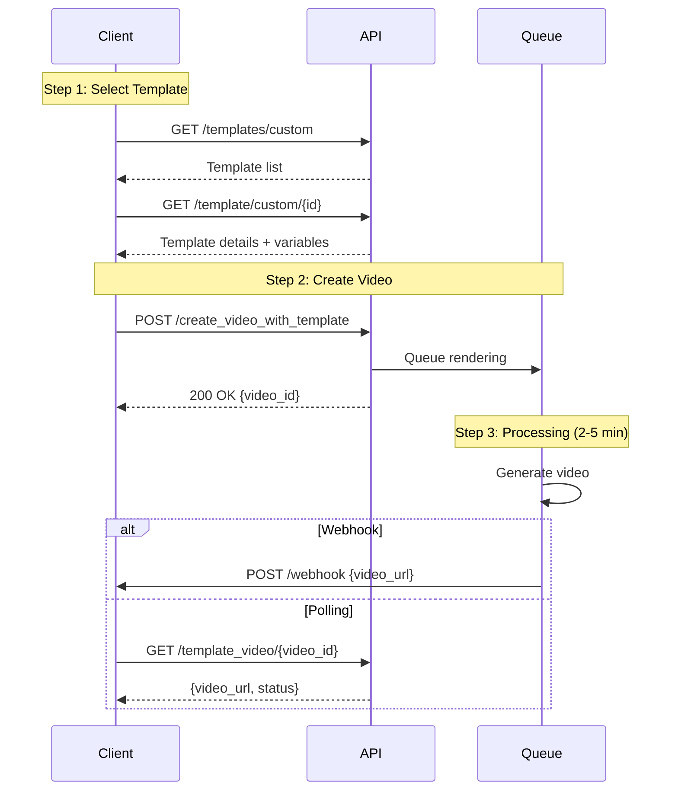

## Introduction

Use templates to create professional videos with consistent branding. Choose from JoggAI's template library or create custom templates with your own layout and design.

### Key Features

<CardGroup cols={2}>
  <Card title="Fast Creation" icon="bolt">
    Skip the design process with ready-made templates
  </Card>
  <Card title="Brand Consistency" icon="palette">
    Maintain consistent style across all videos
  </Card>
  <Card title="Batch Processing" icon="layer-group">
    Generate multiple videos with the same template
  </Card>
  <Card title="Flexible Variables" icon="sliders">
    Customize text, images, videos, and scripts
  </Card>
</CardGroup>

### Workflow Overview

Template video creation is a **3-step asynchronous process**:

<Steps>
  <Step title="Select Template">
    Browse and choose a template from your library
  </Step>
  
  <Step title="Customize Variables">
    Provide values for template variables (text, images, etc.)
  </Step>
  
  <Step title="Generate & Retrieve">
    Video renders in background, retrieve when complete
  </Step>
</Steps>



<Info>
Template videos typically take 2-5 minutes to generate. Use webhooks for best experience.
</Info>

---

## Quick Start

### Related API Endpoints

| Endpoint | Purpose | Documentation |
|----------|---------|---------------|
| `GET /templates/custom` | List your custom templates | [API Reference](/api-reference/v2/Template/GetTemplates) |
| `GET /template/custom/{id}` | Get template details | [API Reference](/api-reference/v2/Template/GetTemplateById) |
| `POST /create_video_with_template` | Create video from template | [API Reference](/api-reference/v2/Video/CreateVideoWithTemplate) |
| `GET /template_video/{video_id}` | Check video status | [API Reference](/api-reference/v2/Video/GetTemplateVideo) |

### Key Parameters

| Parameter | Type | Required | Description |
|-----------|------|----------|-------------|
| `template_id` | integer | ✅ | Template ID |
| `template_type` | string | ✅ | "common" (public) or "user" (custom) |
| `variables` | array | ✅ | Template variables (text, image, video, script) |
| `avatar_id` | integer | ❌ | Override template avatar |
| `avatar_type` | integer | ❌ | 0=Public, 1=Custom |
| `voice_id` | string | ❌ | Override template voice |
| `music_id` | integer | ❌ | Override background music |
| `caption` | boolean | ❌ | Enable subtitles |

---

## Code Examples

### Scenario 1: List Available Templates

First, browse your custom templates:

```bash
curl --request GET \
  --url 'https://api.jogg.ai/v2/templates/custom?aspect_ratio=portrait' \
  --header 'x-api-key: YOUR_API_KEY'
```

**Response:**

```json
{
  "code": 0,
  "msg": "Success",
  "data": {
    "templates": [
      {
        "id": 1234,
        "name": "Product Showcase Template",
        "cover_url": "https://res.jogg.ai/templates/cover_1234.jpg",
        "preview_url": "https://res.jogg.ai/templates/preview_1234.mp4",
        "aspect_ratio": 0
      }
    ]
  }
}
```

<Check>
Filter by `aspect_ratio`: `portrait` (Portrait), `landscape` (Landscape), `square` (Square)
</Check>

---

### Scenario 2: Get Template Details

View template variables and requirements:

```bash
curl --request GET \
  --url 'https://api.jogg.ai/v2/template/custom/1234' \
  --header 'x-api-key: YOUR_API_KEY'
```

**Response:**

```json
{
  "code": 0,
  "msg": "Success",
  "data": {
    "id": 1234,
    "name": "Product Showcase Template",
    "aspect_ratio": 0,
    "variables": [
      {
        "name": "product_name",
        "type": "text",
        "required": true
      },
      {
        "name": "product_image",
        "type": "image",
        "required": true
      },
      {
        "name": "script",
        "type": "script",
        "required": true
      }
    ]
  }
}
```

<Tip>
Check the `variables` array to see what values you need to provide.
</Tip>

---

### Scenario 3: Create Video with Text Variables

Use template with text customization:

```bash
curl --request POST \
  --url 'https://api.jogg.ai/v2/create_video_with_template' \
  --header 'x-api-key: YOUR_API_KEY' \
  --header 'Content-Type: application/json' \
  --data '{
    "template_id": 1234,
    "template_type": "user",
    "avatar_id": 81,
    "avatar_type": 0,
    "voice_id": "en-US-ChristopherNeural",
    "caption": true,
    "variables": [
      {
        "type": "text",
        "name": "product_name",
        "properties": {
          "content": "Amazing Smart Watch"
        }
      },
      {
        "type": "script",
        "name": "script",
        "properties": {
          "content": "Discover the future of wearable technology with our Amazing Smart Watch!"
        }
      }
    ]
  }'
```

**Response:**

```json
{
  "code": 0,
  "msg": "Success",
  "data": {
    "video_id": "video_123456"
  }
}
```

---

### Scenario 4: Create Video with Image Variables

Include custom images in template:

```bash
curl --request POST \
  --url 'https://api.jogg.ai/v2/create_video_with_template' \
  --header 'x-api-key: YOUR_API_KEY' \
  --header 'Content-Type: application/json' \
  --data '{
    "template_id": 1234,
    "template_type": "user",
    "avatar_id": 81,
    "avatar_type": 0,
    "voice_id": "en-US-ChristopherNeural",
    "variables": [
      {
        "type": "text",
        "name": "product_name",
        "properties": {
          "content": "Amazing Smart Watch"
        }
      },
      {
        "type": "image",
        "name": "product_image",
        "properties": {
          "url": "https://example.com/watch.jpg"
        }
      },
      {
        "type": "script",
        "name": "script",
        "properties": {
          "content": "Check out this amazing smart watch!"
        }
      }
    ]
  }'
```

<Info>
Use `url` for external images or `asset_id` for uploaded assets.
</Info>

---

### Scenario 5: Create Video with Uploaded Assets

Use previously uploaded assets:

```bash
curl --request POST \
  --url 'https://api.jogg.ai/v2/create_video_with_template' \
  --header 'x-api-key: YOUR_API_KEY' \
  --header 'Content-Type: application/json' \
  --data '{
    "template_id": 1234,
    "template_type": "user",
    "variables": [
      {
        "type": "image",
        "name": "product_image",
        "properties": {
          "asset_id": 5678
        }
      },
      {
        "type": "video",
        "name": "background_video",
        "properties": {
          "asset_id": 9012
        }
      }
    ]
  }'
```

<Tip>
Upload assets first using [Upload Media](/api-reference/v2/API%20Documentation/UploadMedia), then reference by `asset_id`.
</Tip>

---

### Scenario 6: Check Video Status

Poll for video completion:

```bash
curl --request GET \
  --url 'https://api.jogg.ai/v2/template_video/video_123456' \
  --header 'x-api-key: YOUR_API_KEY'
```

**Response (Completed):**

```json
{
  "code": 0,
  "msg": "Success",
  "data": {
    "id": "video_123456",
    "status": "completed",
    "video_url": "https://res.jogg.ai/videos/video_123456.mp4",
    "cover_url": "https://res.jogg.ai/covers/video_123456.jpg",
    "duration": 30,
    "created_at": 1732806631
  }
}
```

---

## Variable Types Reference

### Text Variables

```json
{
  "type": "text",
  "name": "product_name",
  "properties": {
    "content": "Your text here"
  }
}
```

### Image Variables

```json
{
  "type": "image",
  "name": "product_image",
  "properties": {
    "url": "https://example.com/image.jpg"
    // OR
    "asset_id": 1234
  }
}
```

### Video Variables

```json
{
  "type": "video",
  "name": "background_video",
  "properties": {
    "url": "https://example.com/video.mp4"
    // OR
    "asset_id": 5678
  }
}
```

### Script Variables

```json
{
  "type": "script",
  "name": "script",
  "properties": {
    "content": "Your script text here"
  }
}
```

---

## Use Case Examples

<AccordionGroup>
  <Accordion title="E-commerce Product Videos">
    Create consistent product videos at scale:
    - Use same template for entire catalog
    - Swap product images and names
    - Maintain brand consistency
    - Batch process hundreds of products
  </Accordion>
  
  <Accordion title="Social Media Campaigns">
    Launch coordinated campaigns:
    - Create template matching brand guidelines
    - Generate videos for different products
    - Consistent look across all posts
    - Quick turnaround for trending topics
  </Accordion>
  
  <Accordion title="Real Estate Listings">
    Showcase properties professionally:
    - Standard template for all listings
    - Swap property images and details
    - Include agent information
    - Generate videos for new listings instantly
  </Accordion>
  
  <Accordion title="Educational Content">
    Create course materials efficiently:
    - Consistent lesson format
    - Swap topics and examples
    - Professional appearance
    - Scale content production
  </Accordion>
</AccordionGroup>

---

## Best Practices

### Template Selection

<Tip>
- Choose templates matching your aspect ratio needs (9:16, 16:9, 1:1)
- Preview templates before bulk production
- Test with sample data first
- Ensure template variables match your data structure
</Tip>

### Image Quality

- Use high-resolution images (minimum 1920x1080)
- Ensure image URLs are publicly accessible (HTTPS)
- Test images are not corrupted
- Optimize image file sizes (< 10MB)

### Batch Processing

When creating multiple videos:
1. Submit all requests first
2. Use [Webhooks](/api-reference/v2/API%20Documentation/WebhookIntegration) for notifications
3. Implement retry logic for failures
4. Monitor rate limits

---

## Troubleshooting

<AccordionGroup>
  <Accordion title="Template Not Found">
    **Error**: `Template ID does not exist`
    
    **Solutions:**
    - Verify `template_id` is correct
    - Check `template_type` is "common" or "user"
    - List all templates to find correct ID
    - Ensure template exists in your account
  </Accordion>
  
  <Accordion title="Missing Required Variables">
    **Error**: `Required template variable missing`
    
    **Solutions:**
    - Get template details to see required variables
    - Ensure all required variables are in `variables` array
    - Check variable names match exactly (case-sensitive)
    - Verify variable types are correct
  </Accordion>
  
  <Accordion title="Image/Video URL Not Accessible">
    **Error**: `Failed to load asset from URL`
    
    **Solutions:**
    - Ensure URLs are publicly accessible
    - Use HTTPS (not HTTP)
    - Check file format is supported
    - Verify file size is within limits
    - Test URL in browser first
  </Accordion>
  
  <Accordion title="Video Generation Failed">
    **Error**: Video status is "failed"
    
    **Solutions:**
    - Check error message in response
    - Verify all assets are valid
    - Ensure script length is appropriate
    - Try with simpler variables first
    - Contact support if issue persists
  </Accordion>
</AccordionGroup>

---

## Related Documentation

<CardGroup cols={2}>
  <Card
    title="Get Templates API"
    icon="layer-group"
    href="/api-reference/v2/Template/GetTemplates"
  >
    Browse available templates
  </Card>
  
  <Card
    title="Upload Media"
    icon="upload"
    href="/api-reference/v2/API%20Documentation/UploadMedia"
  >
    Upload images and videos for templates
  </Card>
  
  <Card
    title="Create Avatar Videos"
    icon="user"
    href="/api-reference/v2/API%20Documentation/CreateAvatarVideos"
  >
    Alternative video creation method
  </Card>
  
  <Card
    title="Webhook Integration"
    icon="webhook"
    href="/api-reference/v2/API%20Documentation/WebhookIntegration"
  >
    Get notified when videos are ready
  </Card>
</CardGroup>
