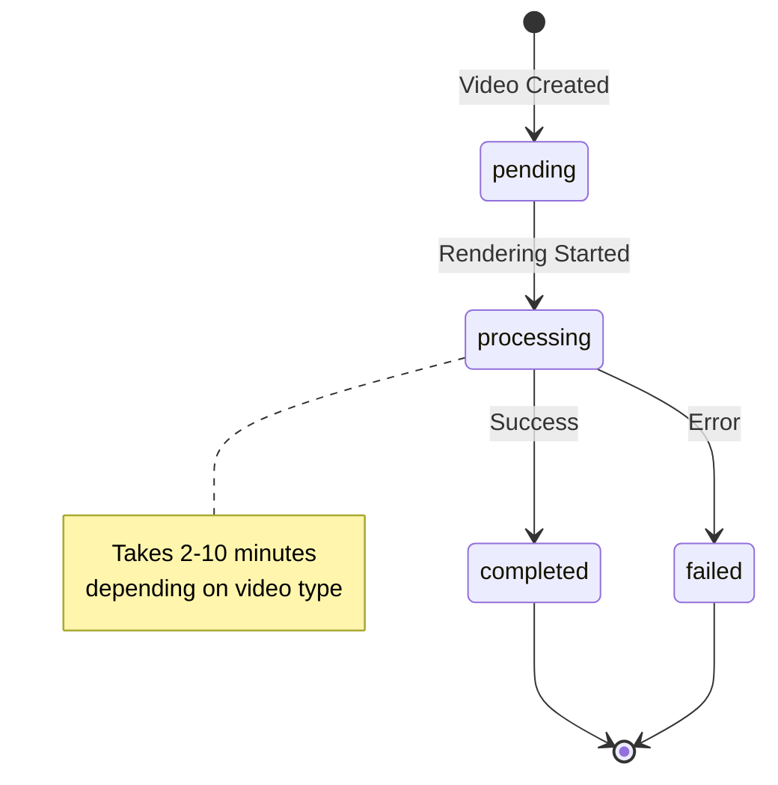
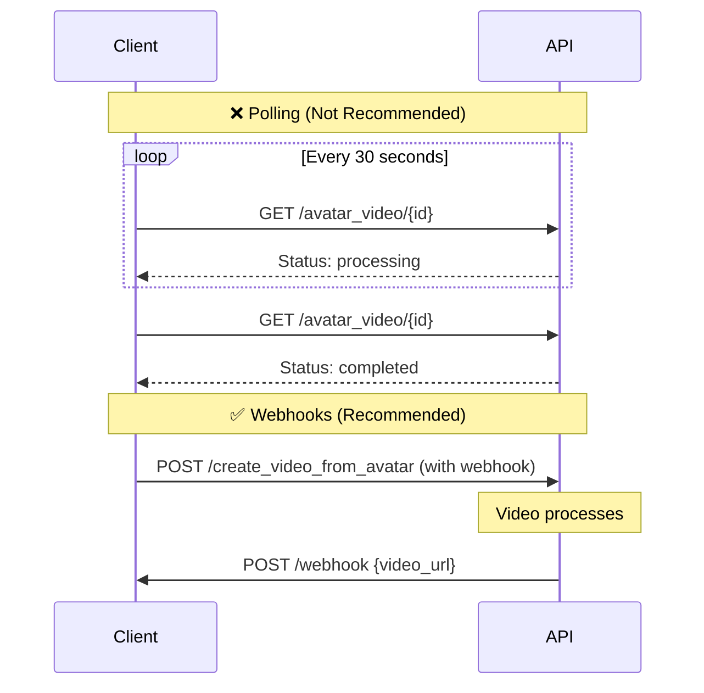

## Introduction

Check the status of your video generation tasks and retrieve download URLs when completed. This guide covers polling strategies and status interpretation for all video types (Avatar Videos, Product Videos, and Template Videos). Use webhooks for instant notifications or polling for status checks.

### Key Features

<CardGroup cols={2}>
  <Card title="Real-Time Status" icon="circle-check">
    Get current processing status instantly
  </Card>
  <Card title="Video Download" icon="download">
    Retrieve final video URLs when ready
  </Card>
  <Card title="Error Details" icon="circle-exclamation">
    Get detailed error messages if failed
  </Card>
  <Card title="Metadata" icon="info-circle">
    Access duration, cover images, and more
  </Card>
</CardGroup>

### Workflow Overview

Video generation follows a standard status flow:



<Info>
Videos typically take 2-10 minutes to generate depending on length and complexity. Use webhooks for instant notifications instead of polling.
</Info>

---

## Quick Start

### Related API Endpoints

| Video Type | Get Status Endpoint | Documentation |
|------------|-------------------|---------------|
| **Avatar Videos** | `GET /v2/avatar_video/{id}` | [API Reference](/api-reference/v2/Video/AvatarVideoGet) |
| **Product Videos** | `GET /v2/product_video/{product_video_id}` | [API Reference](/api-reference/v2/Video/ProductVideoGet) |
| **Template Videos** | `GET /v2/template_video/{video_id}` | [API Reference](/api-reference/v2/Video/TemplateVideoGet) |

### Status Values

| Status | Description | Next Action |
|--------|-------------|-------------|
| `pending` | Queued, not started yet | Wait and poll again |
| `processing` | Currently rendering | Wait and poll again |
| `completed` | Video is ready | Download from `video_url` |
| `failed` | Error occurred | Check error message |

<Tip>
**Recommended**: Use [Webhooks](/api-reference/v2/API%20Documentation/WebhookIntegration) instead of polling for better performance and instant notifications.
</Tip>

---

## Code Examples

### Scenario 1: Check Avatar Video Status

Poll for avatar video completion:

```bash
curl --request GET \
  --url 'https://api.jogg.ai/v2/avatar_video/video_123456' \
  --header 'x-api-key: YOUR_API_KEY'
```

**Response (Processing):**

```json
{
  "code": 0,
  "msg": "Success",
  "data": {
    "video_id": "video_123456",
    "status": "processing",
    "created_at": 1732806631
  }
}
```

**Response (Completed):**

```json
{
  "code": 0,
  "msg": "Success",
  "data": {
    "video_id": "video_123456",
    "status": "completed",
    "video_url": "https://res.jogg.ai/videos/video_123456.mp4",
    "cover_url": "https://res.jogg.ai/covers/video_123456.jpg",
    "duration": 30,
    "created_at": 1732806631
  }
}
```

<Check>
When `status` is `completed`, download the video from `video_url`.
</Check>

---

### Scenario 1: Check Product Video Status

```bash
curl --request GET \
  --url 'https://api.jogg.ai/v2/product_video/pv_789012' \
  --header 'x-api-key: YOUR_API_KEY'
```

**Response (Completed):**

```json
{
  "code": 0,
  "msg": "Success",
  "data": {
    "id": "pv_789012",
    "status": "completed",
    "video_url": "https://res.jogg.ai/videos/pv_789012.mp4",
    "cover_url": "https://res.jogg.ai/covers/pv_789012.jpg",
    "video_duration": 30.5,
    "created_at": 1732806631
  }
}
```

**Response (Failed):**

```json
{
  "code": 0,
  "msg": "Success",
  "data": {
    "id": "pv_789012",
    "status": "failed",
    "error": {
      "code": 50000,
      "message": "Insufficient media quality for video generation"
    },
    "created_at": 1732806631
  }
}
```

<Warning>
If status is `failed`, check the `error` object for details and retry with corrected parameters.
</Warning>

---

### Scenario 1: Check Template Video Status

```bash
curl --request GET \
  --url 'https://api.jogg.ai/v2/template_video/video_123456' \
  --header 'x-api-key: YOUR_API_KEY'
```

**Response (Completed):**

```json
{
  "code": 0,
  "msg": "Success",
  "data": {
    "video_id": "video_123456",
    "status": "completed",
    "video_url": "https://res.jogg.ai/videos/video_123456.mp4",
    "cover_url": "https://res.jogg.ai/covers/cover_123456.jpg",
    "duration": 30,
    "created_at": 1732806631
  }
}
```

---

## Use Case Examples

<AccordionGroup>
  <Accordion title="Polling Strategy">
    **When to Use**: When webhooks are not available or you need immediate status checks.
    
    **Recommended Schedule**:
    - Wait 10-15 seconds before first poll
    - Poll every 10 seconds for first minute
    - Increase to 30 seconds, then 60 seconds
    - Stop after 10 minutes and check for issues
    
    <Warning>
    Do not poll faster than every 5 seconds to avoid rate limiting.
    </Warning>
  </Accordion>
  
  <Accordion title="Webhook Integration">
    **When to Use**: Recommended for production applications.
    
    **Advantages**:
    - ✅ No polling overhead
    - ✅ Instant notifications
    - ✅ Reduced API calls
    - ✅ Better scalability
    - ✅ Lower latency
    
    See [Webhook Integration](/api-reference/v2/API%20Documentation/WebhookIntegration) for setup.
  </Accordion>
  
  <Accordion title="Batch Status Checks">
    **When to Use**: Checking status of multiple videos.
    
    **Strategy**:
    - Use list endpoints (`/v2/template_videos`, `/v2/product_videos`) to get status of multiple videos
    - Filter by status to find completed/failed videos
    - Process completed videos, retry failed ones
  </Accordion>
</AccordionGroup>

---

## Tips for Best Results

<Tip>
**Polling Strategy:**
- Wait 10-15 seconds before first poll (videos rarely complete faster)
- Poll every 10 seconds for first minute
- Increase to 30 seconds, then 60 seconds
- Stop after 10 minutes and check for issues
</Tip>

**Use Webhooks Instead:**
- Use [Webhooks](/api-reference/v2/API%20Documentation/WebhookIntegration) instead of polling for better performance
- Instant notifications when videos are ready
- Reduced API calls and better scalability
- Lower latency for end users

**Polling Schedule:**

| Time Elapsed | Poll Interval | Reason |
|--------------|---------------|---------|
| 0-60s | Every 10s | Videos might complete quickly |
| 1-5min | Every 30s | Normal processing time |
| 5-10min | Every 60s | Handling queue delays |
| > 10min | Stop | Likely an issue, check logs |

**Webhook vs Polling:**



---

## Response Field Reference

### Completed Video Response

| Field | Type | Description |
|-------|------|-------------|
| `video_id` / `id` | string | Video identifier |
| `status` | string | Current status (`completed`) |
| `video_url` | string | Download URL for MP4 file |
| `cover_url` | string | Thumbnail/cover image URL |
| `duration` / `video_duration` | number | Video length in seconds |
| `title` | string | Video title (if provided) |
| `created_at` | integer | Unix timestamp of creation |

### Processing Video Response

| Field | Type | Description |
|-------|------|-------------|
| `video_id` / `id` | string | Video identifier |
| `status` | string | Current status (`pending` or `processing`) |
| `created_at` | integer | Unix timestamp |

### Failed Video Response

| Field | Type | Description |
|-------|------|-------------|
| `video_id` / `id` | string | Video identifier |
| `status` | string | Status (`failed`) |
| `error.code` | integer | Error code |
| `error.message` | string | Human-readable error description |
| `created_at` | integer | Unix timestamp |

---

## Troubleshooting

<AccordionGroup>
  <Accordion title="Video Not Found (404)">
    **Error**: `Video ID does not exist`
    
    **Solutions:**
    - Verify video ID is correct
    - Check if video creation succeeded
    - Video IDs are case-sensitive
    - Ensure you're using the correct endpoint for video type
  </Accordion>
  
  <Accordion title="Generation Failed">
    **Error**: Status is `failed` with error object
    
    **Common Causes:**
    - Insufficient media quality
    - Invalid avatar/voice combination
    - Script too long for video length
    - API quota exceeded
    - Invalid template variables
    
    **Solutions:**
    - Check error message in response
    - Verify all input parameters are valid
    - Retry with corrected parameters
    - Check [Error Handling Guide](/api-reference/v2/QuickStart/ErrorHandling)
  </Accordion>
  
  <Accordion title="Processing Timeout">
    **Issue**: Video stuck in processing > 15 minutes
    
    **Solutions:**
    - Contact support with video ID
    - Check [Status Page](https://status.jogg.ai)
    - Retry video creation
    - Verify video type and parameters
  </Accordion>
  
  <Accordion title="Rate Limiting">
    **Error**: Too many requests
    
    **Solutions:**
    - Reduce polling frequency (minimum 5 seconds between polls)
    - Use webhooks instead of polling
    - Check [Rate Limits](/api-reference/v2/QuickStart/RateLimits)
    - Implement exponential backoff
  </Accordion>
</AccordionGroup>

---

## Related Documentation

<CardGroup cols={2}>
  <Card
    title="Webhook Integration"
    icon="webhook"
    href="/api-reference/v2/API%20Documentation/WebhookIntegration"
  >
    Better alternative to polling
  </Card>
  
  <Card
    title="Create Avatar Videos"
    icon="user"
    href="/api-reference/v2/API%20Documentation/CreateAvatarVideos"
  >
    Start video generation
  </Card>
  
  <Card
    title="Error Handling"
    icon="circle-exclamation"
    href="/api-reference/v2/QuickStart/ErrorHandling"
  >
    Understand error responses
  </Card>
  
  <Card
    title="Rate Limits"
    icon="gauge"
    href="/api-reference/v2/QuickStart/RateLimits"
  >
    API usage limits
  </Card>
</CardGroup>
