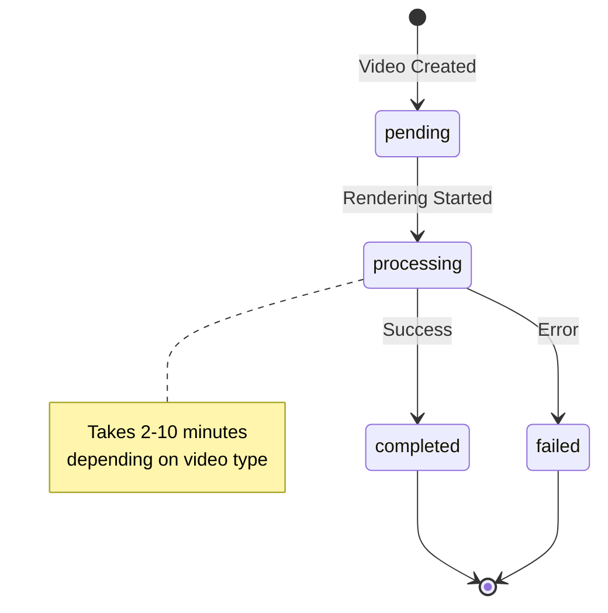
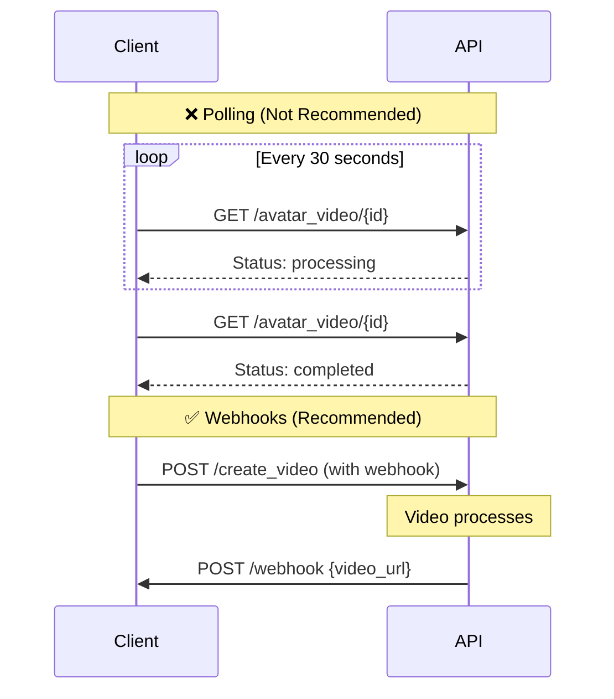

## Introduction

Check the status of your video generation tasks and retrieve download URLs when completed. This guide covers polling strategies and status interpretation for all video types.

### Key Features

<CardGroup cols={2}>
  <Card title="Real-Time Status" icon="circle-check">
    Get current processing status instantly
  </Card>
  <Card title="Video Download" icon="download">
    Retrieve final video URLs when ready
  </Card>
  <Card title="Error Details" icon="circle-exclamation">
    Get detailed error messages if failed
  </Card>
  <Card title="Metadata" icon="info-circle">
    Access duration, cover images, and more
  </Card>
</CardGroup>

### Status Flow



---

## Quick Start

### Related API Endpoints

| Video Type | Get Status Endpoint | Documentation |
|------------|-------------------|---------------|
| **Avatar Videos** | `GET /avatar_video/{id}` | [API Reference](/api-reference/v2/Video/GetAvatarVideo) |
| **Product Videos** | `GET /product_video/{id}` | [API Reference](/api-reference/v2/Video/GetProductVideo) |
| **Template Videos** | `GET /template_video/{id}` | [API Reference](/api-reference/v2/Video/CreateVideoWithTemplate) |

### Status Values

| Status | Description | Next Action |
|--------|-------------|-------------|
| `pending` | Queued, not started yet | Wait and poll again |
| `processing` | Currently rendering | Wait and poll again |
| `completed` | Video is ready | Download from `video_url` |
| `failed` | Error occurred | Check error message |

---

## Code Examples

### Scenario 1: Check Avatar Video Status

Poll for avatar video completion:

```bash
curl --request GET \
  --url 'https://api.jogg.ai/open/v2/avatar_video/video_123456' \
  --header 'x-api-key: YOUR_API_KEY'
```

**Response (Processing):**

```json
{
  "code": 0,
  "msg": "Success",
  "data": {
    "id": "video_123456",
    "status": "processing",
    "created_at": 1732806631
  }
}
```

**Response (Completed):**

```json
{
  "code": 0,
  "msg": "Success",
  "data": {
    "id": "video_123456",
    "status": "completed",
    "video_url": "https://res.jogg.ai/videos/video_123456.mp4",
    "cover_url": "https://res.jogg.ai/covers/video_123456.jpg",
    "duration": 30,
    "created_at": 1732806631
  }
}
```

---

### Scenario 2: Check Product Video Status

```bash
curl --request GET \
  --url 'https://api.jogg.ai/open/v2/product_video/pv_789012' \
  --header 'x-api-key: YOUR_API_KEY'
```

**Response (Failed):**

```json
{
  "code": 0,
  "msg": "Success",
  "data": {
    "id": "pv_789012",
    "status": "failed",
    "error": {
      "code": 50000,
      "message": "Insufficient media quality for video generation"
    },
    "created_at": 1732806631
  }
}
```

---

## Polling Best Practices

### Recommended Polling Strategy

<Steps>
  <Step title="Initial Wait">
    Wait 10-15 seconds before first poll (videos rarely complete faster)
  </Step>
  
  <Step title="Frequent Checks">
    Poll every 10 seconds for first minute
  </Step>
  
  <Step title="Gradual Backoff">
    Increase to 30 seconds, then 60 seconds
  </Step>
  
  <Step title="Timeout">
    Stop after 10 minutes and check for issues
  </Step>
</Steps>

### Polling Schedule Example

| Time Elapsed | Poll Interval | Reason |
|--------------|---------------|---------|
| 0-60s | Every 10s | Videos might complete quickly |
| 1-5min | Every 30s | Normal processing time |
| 5-10min | Every 60s | Handling queue delays |
| > 10min | Stop | Likely an issue, check logs |

<Warning>
**Do not poll faster than every 5 seconds** to avoid rate limiting.
</Warning>

---

## Use Webhooks Instead

<Tip>
**Recommended Approach**: Use [Webhooks](/api-reference/v2/API%20Documentation/WebhookIntegration) instead of polling for better performance and user experience.
</Tip>

**Advantages of Webhooks:**
- ✅ No polling overhead
- ✅ Instant notifications
- ✅ Reduced API calls
- ✅ Better scalability
- ✅ Lower latency

**Webhook vs Polling Comparison:**



---

## Error Handling

### Common Error Scenarios

<AccordionGroup>
  <Accordion title="Video Not Found (404)">
    **Cause**: Invalid video ID or video was deleted
    
    **Solution**:
    - Verify video ID is correct
    - Check if video creation succeeded
    - Video IDs are case-sensitive
  </Accordion>
  
  <Accordion title="Generation Failed">
    **Response:**
    ```json
    {
      "status": "failed",
      "error": {
        "code": 50000,
        "message": "Video generation failed"
      }
    }
    ```
    
    **Common Causes**:
    - Insufficient media quality
    - Invalid avatar/voice combination
    - Script too long for video length
    - API quota exceeded
    
    **Solution**: Check error message and retry with corrected parameters
  </Accordion>
  
  <Accordion title="Processing Timeout">
    **Cause**: Video stuck in processing > 15 minutes
    
    **Solution**:
    - Contact support with video ID
    - Check [Status Page](https://status.jogg.ai)
    - Retry video creation
  </Accordion>
</AccordionGroup>

---

## Response Field Reference

### Completed Video Response

| Field | Type | Description |
|-------|------|-------------|
| `id` | string | Video identifier |
| `status` | string | Current status (completed) |
| `video_url` | string | Download URL for MP4 file |
| `cover_url` | string | Thumbnail/cover image URL |
| `duration` | integer | Video length in seconds |
| `title` | string | Video title (if provided) |
| `created_at` | integer | Unix timestamp of creation |

### Failed Video Response

| Field | Type | Description |
|-------|------|-------------|
| `id` | string | Video identifier |
| `status` | string | Status (failed) |
| `error.code` | integer | Error code |
| `error.message` | string | Human-readable error description |
| `created_at` | integer | Unix timestamp |

---

## Related Documentation

<CardGroup cols={2}>
  <Card
    title="Webhook Integration"
    icon="webhook"
    href="/api-reference/v2/API%20Documentation/WebhookIntegration"
  >
    Better alternative to polling
  </Card>
  
  <Card
    title="Create Avatar Videos"
    icon="user"
    href="/api-reference/v2/API%20Documentation/CreateAvatarVideos"
  >
    Start video generation
  </Card>
  
  <Card
    title="Error Handling"
    icon="circle-exclamation"
    href="/api-reference/v2/QuickStart/ErrorHandling"
  >
    Understand error responses
  </Card>
  
  <Card
    title="Rate Limits"
    icon="gauge"
    href="/api-reference/v2/QuickStart/RateLimits"
  >
    API usage limits
  </Card>
</CardGroup>
