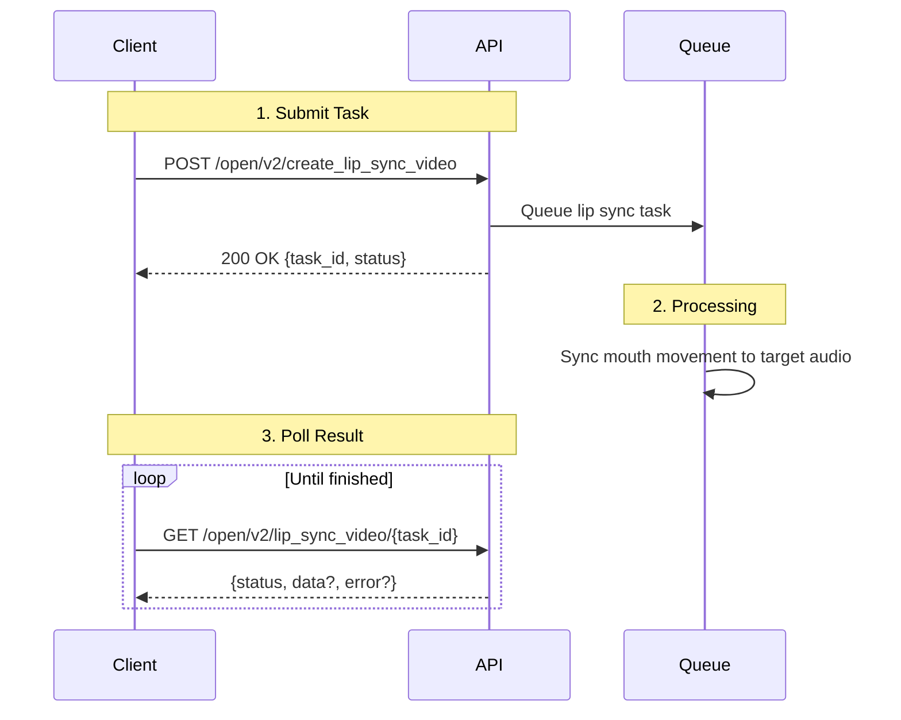

## Introduction

Use the Lip Sync API to generate a new video where the speaker's mouth movement is synchronized to a target audio track. Submit a source video URL and an audio URL, then poll the task status until the final result is ready.

### Key Features

<CardGroup cols={2}>
  <Card title="Async Processing" icon="bolt">
    Submit once and retrieve results when processing completes
  </Card>
  <Card title="Simple Input" icon="link">
    Create tasks with just a video URL and an audio URL
  </Card>
  <Card title="Flexible Playback" icon="play">
    Choose how to handle cases where video is shorter than audio
  </Card>
  <Card title="Result Metadata" icon="info-circle">
    Get output video URL, cover image, duration, and error details
  </Card>
</CardGroup>

### Workflow Overview

Lip sync video generation is an **asynchronous 3-step process**:

<Steps>
  <Step title="Submit Task">
    Call the create endpoint with your source video and source audio URLs
  </Step>

  <Step title="Processing">
    JoggAI performs lip sync generation in the background
  </Step>

  <Step title="Retrieve Result">
    Poll the task endpoint until status becomes `success` or `failed`
  </Step>
</Steps>



<Info>
Lip sync generation is asynchronous. After submitting the task, store the returned `task_id` and use it to poll for progress and results.
</Info>

---

## Quick Start

### Related API Endpoints

| Endpoint | Purpose | Documentation |
|----------|---------|---------------|
| `POST /open/v2/create_lip_sync_video` | Submit lip sync task | [API Reference](/api-reference/v2/Video/CreateLipSyncVideo) |
| `GET /open/v2/lip_sync_video/{task_id}` | Check lip sync task status | [API Reference](/api-reference/v2/Video/GetLipSyncVideo) |

### Key Parameters

| Parameter | Type | Required | Description |
|-----------|------|----------|-------------|
| `video_url` | string | ✅ | Publicly accessible source video URL |
| `audio_url` | string | ✅ | Publicly accessible source audio URL |
| `playback_type` | string | ❌ | Playback behavior when source video is shorter than audio |

### Playback Type Values

| Value | Description |
|-------|-------------|
| `normal` | Play the source video normally |
| `normal_reverse` | Alternate forward and reverse playback to extend the video |
| `normal_reverse_by_audio` | Extend playback dynamically based on source audio duration |

### Pricing

| Rule | Value |
|------|-------|
| Credits per duration | `1` credit per `125` seconds |
| Approximate cost per second | `0.008` credits/second |
| Display rule | Round up and keep `2` decimal places |

<Info>
Estimated usage can be calculated from output duration. Since `1 / 125 = 0.008`, the displayed unit cost is approximately `0.01` credits per second when rounded up to `2` decimal places.
</Info>

<Warning>
The `video_url` and `audio_url` must be publicly accessible direct URLs. Temporary or authenticated links may fail during processing.
</Warning>

---

## Code Examples

### Step 1: Submit Lip Sync Task

```bash
curl --request POST \
  --url 'https://api.jogg.ai/open/v2/create_lip_sync_video' \
  --header 'x-api-key: YOUR_API_KEY' \
  --header 'Content-Type: application/json' \
  --data '{
    "video_url": "https://res.jogg.ai/source-video.mp4",
    "audio_url": "https://res.jogg.ai/source-audio.wav",
    "playback_type": "normal"
  }'
```

**Response:**

```json
{
  "code": 0,
  "msg": "Success",
  "data": {
    "task_id": "3d5c6930-d0da-4f7b-826e-cd1530f6734f",
    "status": "pending"
  }
}
```

<Check>
Save the `task_id` from the response. You will need it to poll the lip sync task result.
</Check>

---

### Step 2: Check Task Status

```bash
curl --request GET \
  --url 'https://api.jogg.ai/open/v2/lip_sync_video/3d5c6930-d0da-4f7b-826e-cd1530f6734f' \
  --header 'x-api-key: YOUR_API_KEY'
```

**Response (Processing):**

```json
{
  "code": 0,
  "msg": "Success",
  "data": {
    "task_id": "3d5c6930-d0da-4f7b-826e-cd1530f6734f",
    "status": "processing",
    "created_at": 1741500000,
    "completed_at": null,
    "data": null,
    "error": null
  }
}
```

**Response (Success):**

```json
{
  "code": 0,
  "msg": "Success",
  "data": {
    "task_id": "3d5c6930-d0da-4f7b-826e-cd1530f6734f",
    "status": "success",
    "created_at": 1741500000,
    "completed_at": 1741500030,
    "data": {
      "result_url": "https://res.jogg.ai/lipsync-result.mp4",
      "cover_url": "https://res.jogg.ai/lipsync-cover.jpg",
      "duration_seconds": 12.5
    },
    "error": null
  }
}
```

**Response (Failed):**

```json
{
  "code": 0,
  "msg": "Success",
  "data": {
    "task_id": "3d5c6930-d0da-4f7b-826e-cd1530f6734f",
    "status": "failed",
    "created_at": 1741500000,
    "completed_at": 1741500030,
    "data": null,
    "error": {
      "message": "consume retry limit reached: audio duration fetch failed"
    }
  }
}
```

### Status Values

| Status | Description | Action |
|--------|-------------|--------|
| `pending` | Task has been accepted and queued | Wait, then poll again |
| `processing` | Lip sync is currently being generated | Continue polling |
| `success` | Final video is ready | Download `result_url` |
| `failed` | Task could not be completed | Inspect `error.message` |

<Tip>
Poll every 5-10 seconds for active tasks. In production, avoid overly aggressive polling to reduce unnecessary API traffic.
</Tip>

---

## Use Case Examples

<AccordionGroup>
  <Accordion title="Dubbed social clips">
    Replace or localize speech in short-form videos while preserving the speaker's visual delivery.
  </Accordion>

  <Accordion title="Voice replacement workflows">
    Reuse an existing talking-head video with a different audio track for updated messaging or campaigns.
  </Accordion>

  <Accordion title="Batch content localization">
    Generate multiple lip sync tasks for different audio tracks and languages using the same base video.
  </Accordion>
</AccordionGroup>

---

## Tips for Best Results

<Tip>
**Input quality matters:**
- Use a clear frontal face shot when possible
- Avoid heavy occlusion around the mouth area
- Use clean audio with stable volume
- Prefer publicly accessible CDN URLs over temporary download links
</Tip>

**Playback strategy guidance:**
- Use `normal` when video duration already matches the audio well
- Use `normal_reverse` when you want a simple loop-like extension effect
- Use `normal_reverse_by_audio` when alignment should adapt to the audio duration

**Polling guidance:**
- Start polling a few seconds after task creation
- Poll every 5-10 seconds during active processing
- Stop polling once status is `success` or `failed`

---

## Troubleshooting

<AccordionGroup>
  <Accordion title="Source URL cannot be fetched">
    **Issue:** Task fails because the video or audio file cannot be downloaded.

    **Solutions:**
    - Ensure both URLs are publicly accessible
    - Avoid signed URLs that expire too quickly
    - Verify the files are reachable from outside your network
    - Confirm the linked file is the actual media file, not an HTML preview page
  </Accordion>

  <Accordion title="Task remains processing for too long">
    **Issue:** Status stays `processing` longer than expected.

    **Solutions:**
    - Continue polling with a moderate interval
    - Retry with smaller or simpler media files if needed
    - Verify source media is stable and downloadable
    - Contact support if the task remains stuck for an extended period
  </Accordion>

  <Accordion title="Task failed with audio-related error">
    **Issue:** The API returns an audio parsing or duration error.

    **Solutions:**
    - Make sure the audio URL points to a valid audio file
    - Re-encode the audio into a common format such as WAV or MP3
    - Check whether the source URL returns partial or corrupted content
  </Accordion>
</AccordionGroup>

---

## Related Documentation

<CardGroup cols={2}>
  <Card
    title="Create Lip Sync Video Task"
    icon="code"
    href="/api-reference/v2/Video/CreateLipSyncVideo"
  >
    Full request schema for submitting tasks
  </Card>

  <Card
    title="Get Lip Sync Video Task"
    icon="circle-check"
    href="/api-reference/v2/Video/GetLipSyncVideo"
  >
    Full response schema for task status and result
  </Card>

  <Card
    title="Check Video Result & Status"
    icon="info-circle"
    href="/api-reference/v2/API Documentation/GetResult"
  >
    General guidance for polling asynchronous video tasks
  </Card>

  <Card
    title="Webhook Integration"
    icon="webhook"
    href="/api-reference/v2/API Documentation/WebhookIntegration"
  >
    Recommended callback pattern for async workflows
  </Card>
</CardGroup>
