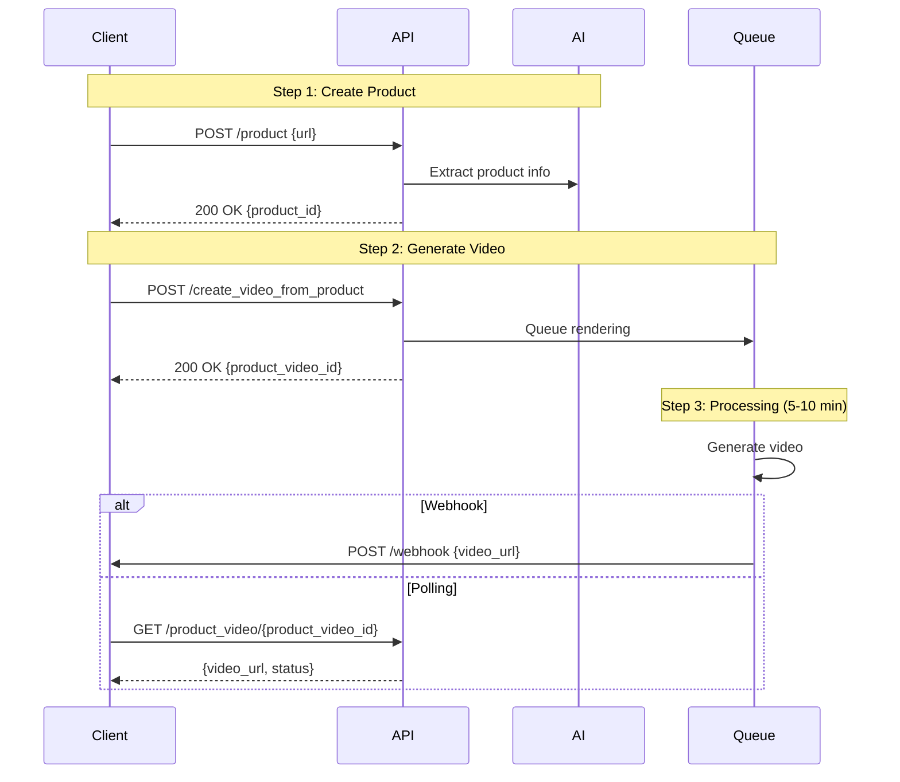

## Introduction

Transform product URLs or descriptions into professional marketing videos automatically. JoggAI analyzes your product, generates AI scripts, and creates complete videos with avatars and voiceovers.

### Key Features

<CardGroup cols={2}>
  <Card title="URL Analysis" icon="link">
    Extract product info from any URL automatically
  </Card>
  <Card title="AI Scripts" icon="wand-magic-sparkles">
    Generate marketing scripts with AI
  </Card>
  <Card title="Visual Styles" icon="palette">
    Choose from 50+ professional templates
  </Card>
  <Card title="Multi-Language" icon="language">
    Create videos in 40+ languages
  </Card>
</CardGroup>

### Workflow Overview

Product video generation is a **3-step asynchronous process**:

<Steps>
  <Step title="Create Product">
    Submit product URL or manual details
  </Step>
  
  <Step title="Generate Video">
    Select avatar, voice, visual style, and script
  </Step>
  
  <Step title="Get Result">
    Retrieve video via webhook or polling (5-10 minutes)
  </Step>
</Steps>



<Info>
The entire process can take **5-10 minutes** depending on video complexity. Use webhooks for best experience.
</Info>

---

## Quick Start

### Related API Endpoints

| Endpoint | Purpose | Documentation |
|----------|---------|---------------|
| `POST /v2/product` | Create product entry | [API Reference](/api-reference/v2/Product/CreateProduct) |
| `GET /v2/avatars/public` | Get avatar list | [API Reference](/api-reference/v2/Avatar/PublicAvatarsGet) |
| `GET /v2/voices` | Get voice list | [API Reference](/api-reference/v2/Voice/GetVoices) |
| `GET /v2/visual_styles` | Get visual styles | [API Reference](/api-reference/v2/Asset/GetVisualStyles) |
| `POST /v2/create_video_from_product/preview_list` | Generate previews | [API Reference](/api-reference/v2/Video/SubmitPreviewList) |
| `POST /v2/create_video_from_product/render_single_preview` | Render final video from preview | [API Reference](/api-reference/v2/Video/RenderSinglePreview) |
| `POST /v2/create_video_from_product` | Generate video directly | [API Reference](/api-reference/v2/Video/CreateVideoFromProduct) |
| `GET /v2/product_video/{product_video_id}` | Check status | [API Reference](/api-reference/v2/Video/ProductVideoGet) |

### Key Parameters

**Create Product (Step 1):**

| Parameter | Type | Required | Description |
|-----------|------|----------|-------------|
| `url` | string | * | Product URL (required if no name) |
| `name` | string | * | Product name (required if no URL) |
| `description` | string | ❌ | Product description |
| `target_audience` | string | ❌ | Target audience description |
| `media` | array | ❌ | Product images/videos array |

**Generate Video (Step 2):**

| Parameter | Type | Required | Description |
|-----------|------|----------|-------------|
| `product_id` | string | ✅ | Product ID from Step 1 |
| `aspect_ratio` | string | ✅ | portrait/landscape/square |
| `video_length` | string | ✅ | "15"/"30"/"60" seconds |
| `language` | string | ✅ | Script language (e.g., "english") |
| `avatar_id` | integer | ✅ | Avatar ID |
| `avatar_type` | integer | ✅ | 0=Public, 1=Custom |
| `script_style` | string | ✅ | Script style (see Script Styles below) |
| `visual_style` | string | ❌ | Visual template name |
| `voice_id` | string | ❌ | Voice ID for TTS |
| `music_id` | integer | ❌ | Background music ID |
| `override_script` | string | ❌ | Custom script to override AI-generated |
| `template_id` | integer | ❌ | Custom template ID |
| `template_type` | string | ❌ | "custom" or "public" |
| `caption` | boolean | ❌ | Enable subtitles (default: false) |

<Warning>
**Product Creation:** You must provide either `url` OR `name` (at least one is required). Providing both is also valid.
</Warning>

---

## Code Examples

### Step 1: Create Product Entry

**Option A: From Product URL**

```bash
curl --request POST \
  --url 'https://api.jogg.ai/v2/product' \
  --header 'x-api-key: YOUR_API_KEY' \
  --header 'Content-Type: application/json' \
  --data '{
    "url": "https://www.amazon.com/dp/B0BX7CVAPM"
  }'
```

**Response:**

```json
{
  "code": 0,
  "msg": "Success",
  "data": {
    "product_id": "NTIzMzc0NjI5",
    "name": "Owala FreeSip Water Bottle",
    "description": "Insulated stainless steel water bottle...",
    "media": [
      {
        "type": 1,
        "url": "https://m.media-amazon.com/images/I/61wvLrf8ekL._AC_SL1500_.jpg"
      }
    ]
  }
}
```

**Option B: Manual Product Details**

```bash
curl --request POST \
  --url 'https://api.jogg.ai/v2/product' \
  --header 'x-api-key: YOUR_API_KEY' \
  --header 'Content-Type: application/json' \
  --data '{
    "name": "Premium Yoga Mat",
    "description": "Eco-friendly yoga mat with superior grip and cushioning. Perfect for all yoga styles.",
    "target_audience": "Yoga enthusiasts and fitness lovers",
    "media": [
      {
        "type": 1,
        "name": "product-image.jpg",
        "url": "https://example.com/yoga-mat.jpg",
        "description": "Main product image"
      }
    ]
  }'
```

<Check>
Save the `product_id` from the response - you'll need it for video generation!
</Check>

---

### Step 2: Generate Video

Create video with AI-generated script:


```bash
curl --request POST \
  --url 'https://api.jogg.ai/v2/create_video_from_product' \
  --header 'x-api-key: YOUR_API_KEY' \
  --header 'Content-Type: application/json' \
  --data '{
    "product_id": "NTIzMzc0NjI5",
    "visual_style": "Simple Product Switch",
    "video_spec": {
      "aspect_ratio": "portrait",
      "length": "30",
      "caption": true
    },
    "avatar": {
      "id": 81,
      "type": 0
    },
    "voice": {
      "id": "en-US-ChristopherNeural"
    },
    "audio": {},
    "script": {
      "style": "Storytime",
      "language": "english"
    }
  }'
```

**Response:**

```json
{
  "code": 0,
  "msg": "Success",
  "data": {
    "product_video_id": "pv_123456"
  }
}
```

<Check>
Save the `product_video_id` to check status later!
</Check>

---

### Step 3: Check Video Status

Poll to check if video is ready:

```bash
curl --request GET \
  --url 'https://api.jogg.ai/v2/product_video/pv_123456' \
  --header 'x-api-key: YOUR_API_KEY'
```

**Response (Processing):**

```json
{
  "code": 0,
  "msg": "Success",
  "data": {
    "id": "pv_123456",
    "status": "processing"
  }
}
```

**Response (Completed):**

```json
{
  "code": 0,
  "msg": "Success",
  "data": {
    "id": "pv_123456",
    "status": "completed",
    "video_url": "https://res.jogg.ai/videos/pv_123456.mp4",
    "cover_url": "https://res.jogg.ai/covers/pv_123456.jpg",
    "duration": 30
  }
}
```

<Tip>
Instead of polling, use [Webhooks](/api-reference/v2/API Documentation/WebhookIntegration) to get notified instantly when videos are ready!
</Tip>

---

## Advanced Examples

### Custom Script Override

Override the AI-generated script with your own:

```bash
curl --request POST \
  --url 'https://api.jogg.ai/v2/create_video_from_product' \
  --header 'x-api-key: YOUR_API_KEY' \
  --header 'Content-Type: application/json' \
  --data '{
    "product_id": "NTIzMzc0NjI5",
    "video_spec": {
      "aspect_ratio": "landscape",
      "length": "30",
      "caption": true
    },
    "avatar": {
      "id": 81,
      "type": 0
    },
    "voice": {
      "id": "en-US-ChristopherNeural"
    },
    "audio": {},
    "script": {
      "style": "Storytime",
      "language": "english"
    },
    "override_script": "Check out this amazing water bottle! It keeps your drinks cold for 24 hours and features a unique FreeSip spout. Perfect for the gym or outdoor adventures!"
  }'
```

<Tip>
Use `override_script` when you have a specific message or want full control over the narration.
</Tip>

---

### Using Background Music

Add background music to your product video:

```bash
curl --request POST \
  --url 'https://api.jogg.ai/v2/create_video_from_product' \
  --header 'x-api-key: YOUR_API_KEY' \
  --header 'Content-Type: application/json' \
  --data '{
    "product_id": "NTIzMzc0NjI5",
    "video_spec": {
      "aspect_ratio": "square",
      "length": "15",
      "caption": false
    },
    "avatar": {
      "id": 81,
      "type": 0
    },
    "voice": {
      "id": "en-US-ChristopherNeural"
    },
    "audio": {
      "music_id": 13
    },
    "script": {
      "style": "Discovery",
      "language": "english"
    }
  }'
```

<Info>
Get available background music using [Get Music API](/api-reference/v2/Asset/GetMusic).
</Info>

---

### Preview Multiple Styles

Generate previews with different visual styles before committing to a final video. This is useful for testing and comparing different styles:

**Step 1: Submit Preview List**

Generate multiple previews with different visual styles:

```bash
curl --request POST \
  --url 'https://api.jogg.ai/v2/create_video_from_product/preview_list' \
  --header 'x-api-key: YOUR_API_KEY' \
  --header 'Content-Type: application/json' \
  --data '{
    "product_id": "NTIzMzc0NjI5",
    "visual_styles": ["Simple Product Switch", "Dynamic Showcase", "Elegant Presentation"],
    "video_spec": {
      "aspect_ratio": "portrait",
      "length": "30",
      "caption": true
    },
    "avatar": {
      "id": 81,
      "type": 0
    },
    "voice": {
      "id": "en-US-ChristopherNeural"
    },
    "audio": {},
    "script": {
      "style": "Storytime",
      "language": "english"
    }
  }'
```

**Response:**

```json
{
  "code": 0,
  "msg": "Success",
  "data": {
    "preview_list_id": "pl_123456",
    "previews": [
      {
        "preview_id": "preview_001",
        "visual_style": "Simple Product Switch",
        "status": "processing"
      },
      {
        "preview_id": "preview_002",
        "visual_style": "Dynamic Showcase",
        "status": "processing"
      },
      {
        "preview_id": "preview_003",
        "visual_style": "Elegant Presentation",
        "status": "processing"
      }
    ]
  }
}
```

<Info>
Preview generation typically takes **2-3 minutes**. Check preview status using the `preview_id` from the response.
</Info>

**Step 2: Render Final Video from Preview**

Once previews are ready, select your preferred preview and render the final video:

```bash
curl --request POST \
  --url 'https://api.jogg.ai/v2/create_video_from_product/render_single_preview' \
  --header 'x-api-key: YOUR_API_KEY' \
  --header 'Content-Type: application/json' \
  --data '{
    "preview_id": "preview_001"
  }'
```

**Response:**

```json
{
  "code": 0,
  "msg": "Success",
  "data": {
    "product_video_id": "pv_123456"
  }
}
```

<Tip>
**When to use previews:**
- Testing multiple visual styles before committing to final video
- Comparing different styles for A/B testing
- Ensuring quality before generating full video
- Saving credits by previewing first
</Tip>

---

## Script Styles Reference

Choose the right script style for your product:

| Style | Best For | Tone |
|-------|----------|------|
| **Storytime** | Narrative products | Engaging, story-driven |
| **Discovery** | New products | Exciting, exploratory |
| **Don't Worry** | Problem-solving | Reassuring, helpful |
| **Data** | Tech products | Factual, informative |
| **Top 3 Reasons** | Feature-rich products | Clear, structured |
| **Light Marketing** | General products | Friendly, promotional |

---

## Use Case Examples

<AccordionGroup>
  <Accordion title="E-commerce Product Videos">
    Automate product video creation for online stores:
    - Bulk generate videos for entire catalog
    - Use portrait format for mobile shopping
    - Enable captions for silent browsing
    - Try multiple script styles for A/B testing
  </Accordion>
  
  <Accordion title="Social Media Advertising">
    Create scroll-stopping ads:
    - Use "Storytime" or "Discovery" styles
    - Keep videos short (15-30 seconds)
    - Choose engaging avatars
    - Add background music for emotion
  </Accordion>
  
  <Accordion title="Marketplace Listings">
    Enhance Amazon/eBay listings:
    - Extract info directly from product URLs
    - Generate in multiple languages for global markets
    - Use landscape format for desktop viewers
    - Highlight key features with "Top 3 Reasons"
  </Accordion>
  
  <Accordion title="Dropshipping Business">
    Scale video content creation:
    - Batch process product URLs
    - Customize scripts for your brand voice
    - Generate localized versions
    - Use webhook automation for efficiency
  </Accordion>
</AccordionGroup>

---

## Tips for Best Results

<Tip>
**Product Information:**
- Provide detailed product descriptions for better AI script generation
- Include target audience information for personalized scripts
- Add high-quality product images for better visual results
- Use clear, descriptive product names
</Tip>

**Script Style Selection:**
- Use "Storytime" for lifestyle products
- Use "Data" for technical products with specifications
- Use "Top 3 Reasons" to highlight key features
- Test different styles to find what works best for your products

**Video Configuration:**
- Use portrait format (9:16) for social media platforms
- Use landscape format (16:9) for YouTube and websites
- Enable captions for better engagement and accessibility
- Choose appropriate video length based on platform (15s for TikTok, 30-60s for YouTube)

---

## Troubleshooting

<AccordionGroup>
  <Accordion title="Product URL not accessible">
    **Error:** `Failed to extract product information`
    
    **Solutions:**
    - Ensure URL is publicly accessible (no login required)
    - Check if URL is from a supported marketplace (Amazon, eBay, etc.)
    - Try providing product details manually instead
    - Verify URL format is correct
  </Accordion>
  
  <Accordion title="Video generation fails">
    **Error:** `Video generation failed`
    
    **Solutions:**
    - Verify product_id is correct and product was created successfully
    - Check that all required parameters are provided
    - Ensure avatar_id and script_style are valid
    - Check API quota/credits balance
  </Accordion>
  
  <Accordion title="Script quality issues">
    **Issue:** Generated script doesn't match product
    
    **Solutions:**
    - Provide more detailed product description
    - Specify target_audience for better personalization
    - Try different script_style options
    - Use override_script for full control
  </Accordion>
</AccordionGroup>

---

## Related Documentation

<CardGroup cols={2}>
  <Card
    title="AI Script Generation"
    icon="wand-magic-sparkles"
    href="/api-reference/v2/API Documentation/AIScripts"
  >
    Generate custom scripts with AI
  </Card>
  
  <Card
    title="Template Videos"
    icon="file-video"
    href="/api-reference/v2/API Documentation/CreateVideoFromTemplate"
  >
    Use templates for consistent branding
  </Card>
  
  <Card
    title="Upload Media"
    icon="upload"
    href="/api-reference/v2/API Documentation/UploadMedia"
  >
    Add custom product images
  </Card>
  
  <Card
    title="Webhook Integration"
    icon="webhook"
    href="/api-reference/v2/API Documentation/WebhookIntegration"
  >
    Automate video delivery
  </Card>
  
  <Card
    title="Submit Preview List"
    icon="eye"
    href="/api-reference/v2/Video/SubmitPreviewList"
  >
    Generate multiple previews with different styles
  </Card>
  
  <Card
    title="Render Single Preview"
    icon="play"
    href="/api-reference/v2/Video/RenderSinglePreview"
  >
    Render final video from selected preview
  </Card>
</CardGroup>
