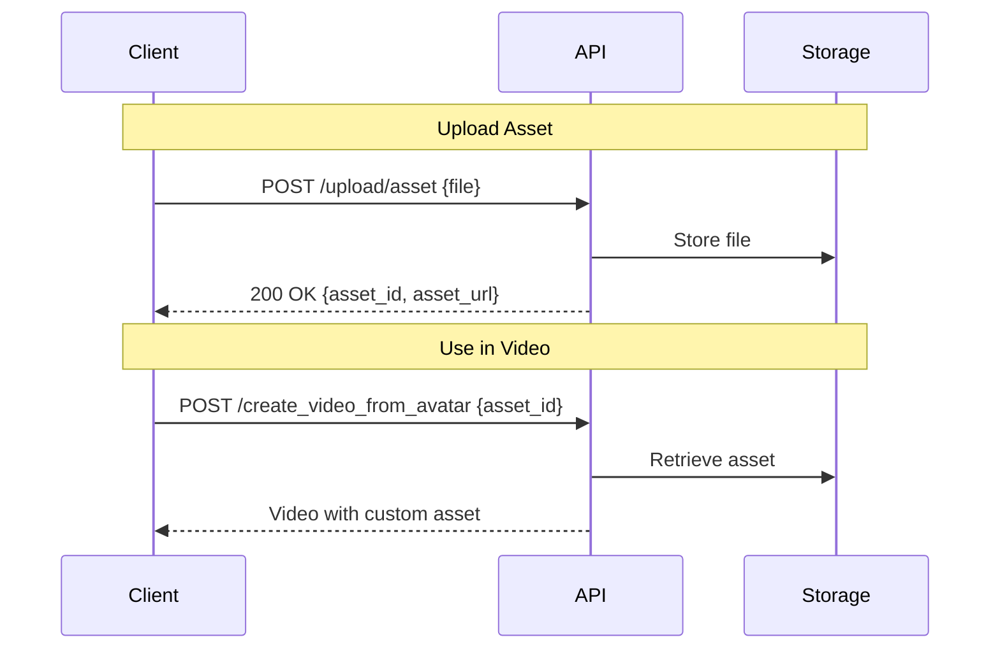

## Introduction

Upload custom media assets to JoggAI to enhance your videos. Include branded images, product photos, background videos, custom audio, and more in your video creation projects.

### Key Features

<CardGroup cols={2}>
  <Card title="Multiple Formats" icon="file">
    Support for images, videos, and audio
  </Card>
  <Card title="Easy Integration" icon="plug">
    Reference assets by ID in video creation
  </Card>
  <Card title="Organized Storage" icon="folder">
    Organize assets into folders
  </Card>
  <Card title="Reusable Assets" icon="recycle">
    Upload once, use in multiple projects
  </Card>
</CardGroup>

### Workflow Overview

<Steps>
  <Step title="Upload Asset">
    Upload your media file via API
  </Step>
  
  <Step title="Get Asset ID">
    Receive asset_id in response
  </Step>
  
  <Step title="Use in Videos">
    Reference asset_id in video creation
  </Step>
</Steps>



<Info>
Assets are stored permanently and can be reused across multiple video projects.
</Info>

---

## Quick Start

### Related API Endpoints

| Endpoint | Purpose | Documentation |
|----------|---------|---------------|
| `POST /upload/asset` | Upload media file | [API Reference](/api-reference/v2/Asset/UploadAsset) |
| `POST /create_video_from_avatar` | Use assets in videos | [API Reference](/api-reference/v2/Video/CreateVideoFromAvatar) |

### Key Parameters

| Parameter | Type | Required | Description |
|-----------|------|----------|-------------|
| `file` | file | ✅ | The media file to upload |
| `asset_type` | string | ✅ | Type: `image`, `video`, or `audio` |
| `name` | string | ✅ | Descriptive name for the asset |
| `description` | string | ❌ | Additional details or tags |
| `folder` | string | ❌ | Organize into folders |

---

## Code Examples

### Scenario 1: Upload Image

Upload product photos, logos, or background images:

```bash
curl --request POST \
  --url 'https://api.jogg.ai/v2/upload/asset' \
  --header 'x-api-key: YOUR_API_KEY' \
  --header 'Content-Type: multipart/form-data' \
  --form 'file=@/path/to/product.jpg' \
  --form 'asset_type=image' \
  --form 'name=Product Photo'
```

**Response:**

```json
{
  "code": 0,
  "msg": "Success",
  "data": {
    "asset_id": "img_abc123",
    "asset_url": "https://res.jogg.ai/assets/img_abc123.jpg",
    "asset_type": "image",
    "file_name": "product.jpg",
    "file_size": 245678,
    "width": 1920,
    "height": 1080,
    "uploaded_at": 1732806631
  }
}
```

**Supported Image Formats:**

| Format | Max Size | Best For |
|--------|----------|----------|
| JPG | 10MB | Photos, product images |
| PNG | 10MB | Images with transparency |
| WebP | 10MB | Modern, efficient format |
| GIF | 10MB | Animated images |

<Check>
Recommended resolution: 1920x1080 or higher
</Check>

---

### Scenario 2: Upload Video

Upload background videos or product demos:

```bash
curl --request POST \
  --url 'https://api.jogg.ai/v2/upload/asset' \
  --header 'x-api-key: YOUR_API_KEY' \
  --header 'Content-Type: multipart/form-data' \
  --form 'file=@/path/to/demo.mp4' \
  --form 'asset_type=video' \
  --form 'name=Product Demo'
```

**Response:**

```json
{
  "code": 0,
  "msg": "Success",
  "data": {
    "asset_id": "vid_def456",
    "asset_url": "https://res.jogg.ai/assets/vid_def456.mp4",
    "asset_type": "video",
    "file_name": "demo.mp4",
    "file_size": 8456789,
    "duration": 30,
    "width": 1920,
    "height": 1080,
    "uploaded_at": 1732806631
  }
}
```

**Supported Video Formats:**

| Format | Max Size | Max Duration | Best For |
|--------|----------|--------------|----------|
| MP4 | 100MB | 5 minutes | Best compatibility |
| WebM | 100MB | 5 minutes | Web optimized |
| MOV | 100MB | 5 minutes | High quality |

<Warning>
Videos longer than 5 minutes will be rejected. Codec: H.264/H.265
</Warning>

---

### Scenario 3: Upload Audio

Upload custom voiceovers or background music:

```bash
curl --request POST \
  --url 'https://api.jogg.ai/v2/upload/asset' \
  --header 'x-api-key: YOUR_API_KEY' \
  --header 'Content-Type: multipart/form-data' \
  --form 'file=@/path/to/music.mp3' \
  --form 'asset_type=audio' \
  --form 'name=Background Music'
```

**Response:**

```json
{
  "code": 0,
  "msg": "Success",
  "data": {
    "asset_id": "aud_ghi789",
    "asset_url": "https://res.jogg.ai/assets/aud_ghi789.mp3",
    "asset_type": "audio",
    "file_name": "music.mp3",
    "file_size": 3456789,
    "duration": 120,
    "uploaded_at": 1732806631
  }
}
```

**Supported Audio Formats:**

| Format | Max Size | Max Duration | Best For |
|--------|----------|--------------|----------|
| MP3 | 20MB | 10 minutes | Best compatibility |
| WAV | 20MB | 10 minutes | Highest quality |
| M4A | 20MB | 10 minutes | Good quality, small size |

<Tip>
Recommended: MP3 at 192 kbps for music, 128 kbps for voice
</Tip>

---

### Scenario 4: Use Uploaded Assets in Video

Reference uploaded assets in video creation:

```bash
curl --request POST \
  --url 'https://api.jogg.ai/v2/create_video_from_avatar' \
  --header 'x-api-key: YOUR_API_KEY' \
  --header 'Content-Type: application/json' \
  --data '{
    "avatar_id": 81,
    "avatar_type": 0,
    "voice_id": "en-US-ChristopherNeural",
    "script": "Check out our amazing product!",
    "aspect_ratio": "portrait",
    "screen_style": 1,
    "background_image": "img_abc123",
    "background_music": "aud_ghi789"
  }'
```

<Info>
Use `asset_id` values to reference your uploaded assets in any video creation endpoint.
</Info>

---

## Format Specifications

### Images

**Recommended Settings:**
- Resolution: 1920x1080 (1080p) or higher
- Quality: 80-90% for JPG
- Format: JPG for photos, PNG for transparency

**Optimization:**
```bash
# Using ImageMagick
convert input.jpg -resize 1920x1080 -quality 85 output.jpg

# Using FFmpeg for WebP
ffmpeg -i input.jpg -q:v 80 output.webp
```

---

### Videos

**Recommended Settings:**
- Resolution: 1920x1080 (1080p)
- Codec: H.264
- Bitrate: 5-8 Mbps
- Frame Rate: 24, 30, or 60 fps
- Audio: AAC, 192 kbps

**Optimization:**
```bash
# Using FFmpeg
ffmpeg -i input.mp4 \
  -vcodec h264 \
  -crf 23 \
  -preset medium \
  -vf scale=1920:1080 \
  -acodec aac \
  -b:a 192k \
  output.mp4
```

---

### Audio

**Recommended Settings:**
- **Music**: MP3, 192-256 kbps, Stereo
- **Voice**: MP3, 128-192 kbps, Mono
- Sample Rate: 44.1 kHz

**Optimization:**
```bash
# Convert to MP3 at 192kbps
ffmpeg -i input.wav -codec:a libmp3lame -b:a 192k output.mp3

# Normalize audio levels
ffmpeg -i input.mp3 -filter:a loudnorm output.mp3
```

---

## Use Case Examples

<AccordionGroup>
  <Accordion title="E-commerce Product Videos">
    Upload product images and demo videos:
    - Product photos in multiple angles
    - Usage demonstration videos
    - Brand logos and watermarks
    - Background music for product showcases
  </Accordion>
  
  <Accordion title="Corporate Videos">
    Create professional corporate content:
    - Company logos and branding
    - Office or facility videos
    - Employee photos
    - Corporate audio branding
  </Accordion>
  
  <Accordion title="Social Media Content">
    Build engaging social media videos:
    - Eye-catching graphics
    - Short video clips
    - Trending audio tracks
    - Branded visual elements
  </Accordion>
  
  <Accordion title="Educational Content">
    Enhance learning materials:
    - Diagrams and charts
    - Demonstration videos
    - Background music
    - Custom voiceovers
  </Accordion>
</AccordionGroup>

---

## Best Practices

### Before Uploading

<Tip>
- **Compress files** to reduce upload time and storage
- **Test files locally** to ensure they're not corrupted
- **Use appropriate formats** (JPG for photos, MP4 for videos, MP3 for audio)
- **Optimize quality** - balance between quality and file size
</Tip>

### Organization

- Use **descriptive names** for easy identification
- Leverage **folder parameter** to organize by project or type
- **Document asset IDs** in your project management system
- Maintain a **local backup** of original files

### File Size Limits

| Asset Type | Max Size | Recommendation |
|------------|----------|----------------|
| Images | 10MB | Aim for 500KB-2MB |
| Videos | 100MB | Aim for 20-50MB |
| Audio | 20MB | Aim for 2-5MB |

---

## Troubleshooting

<AccordionGroup>
  <Accordion title="File Too Large">
    **Error**: `File size exceeds limit`
    
    **Solutions:**
    - **Images**: Reduce resolution or quality (use 80-85% quality for JPG)
    - **Videos**: Lower bitrate, reduce resolution, or shorten duration
    - **Audio**: Convert to MP3, reduce bitrate to 128-192 kbps
    - **General**: Compress before upload using tools like FFmpeg or ImageMagick
  </Accordion>
  
  <Accordion title="Unsupported Format">
    **Error**: `File format not supported`
    
    **Solutions:**
    - Convert to supported format (JPG/PNG for images, MP4 for videos, MP3 for audio)
    - Check file extension matches actual format
    - Ensure file is not corrupted
    - For videos, ensure codec is H.264
  </Accordion>
  
  <Accordion title="Upload Failed">
    **Error**: `Upload failed` or timeout
    
    **Solutions:**
    - Check internet connection stability
    - Verify API key is valid and has upload permissions
    - Ensure file path is correct
    - Try compressing the file first
    - Retry with exponential backoff
  </Accordion>
  
  <Accordion title="Quality Issues">
    **Problem**: Uploaded asset looks poor quality
    
    **Solutions:**
    - Upload higher resolution original files
    - Don't upscale low-resolution images
    - For JPG, use 85-90% quality setting
    - For videos, use appropriate bitrate (5-8 Mbps for 1080p)
    - For audio, use at least 192 kbps for music
  </Accordion>
</AccordionGroup>

---

## Related Documentation

<CardGroup cols={2}>
  <Card
    title="Create Avatar Videos"
    icon="user"
    href="/api-reference/v2/API%20Documentation/CreateAvatarVideos"
  >
    Use uploaded assets in avatar videos
  </Card>
  
  <Card
    title="Product Videos"
    icon="shopping-bag"
    href="/api-reference/v2/API%20Documentation/URLtoVideo"
  >
    Include custom media in product videos
  </Card>
  
  <Card
    title="Template Videos"
    icon="layer-group"
    href="/api-reference/v2/API%20Documentation/CreateVideoFromTemplate"
  >
    Use assets in video templates
  </Card>
  
  <Card
    title="Upload API Reference"
    icon="code"
    href="/api-reference/v2/Asset/UploadAsset"
  >
    Detailed API documentation
  </Card>
</CardGroup>
