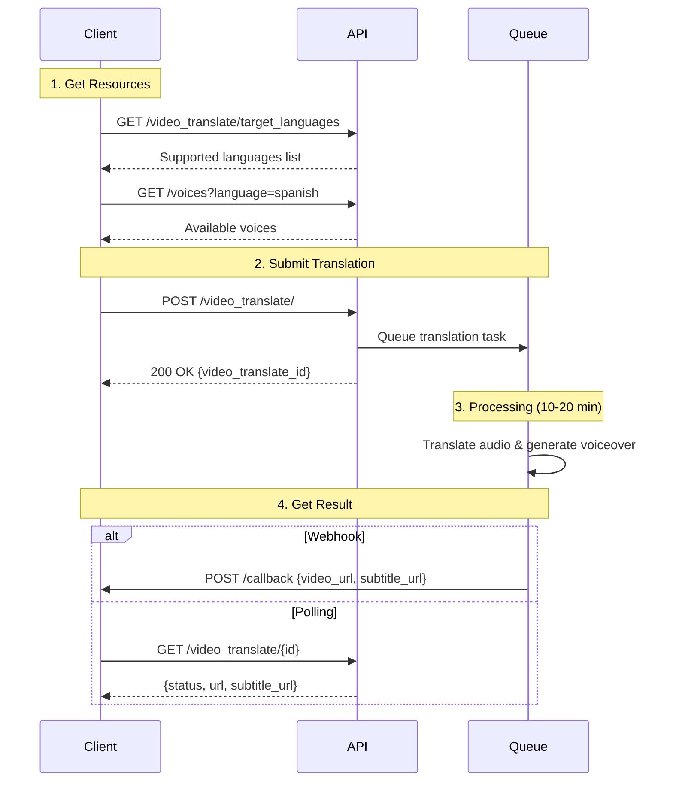

## Introduction

Expand your video content to global audiences by translating videos into 40+ languages with natural-sounding AI voiceovers and synchronized subtitles. No need to re-record or hire translators - simply provide your video URL and target language.

### Key Features

<CardGroup cols={2}>
  <Card title="40+ Languages" icon="globe">
    Support for major European, Asian, and other languages
  </Card>
  <Card title="AI Voiceover" icon="microphone">
    Natural-sounding voices matching original tone
  </Card>
  <Card title="Auto Subtitles" icon="closed-captioning">
    Synchronized subtitles generated automatically
  </Card>
  <Card title="Fast Processing" icon="bolt">
    10-20 minutes average turnaround time
  </Card>
</CardGroup>

### Workflow Overview

Video translation is a **4-step asynchronous process**:

<Steps>
  <Step title="Get Resources">
    Get supported languages and available voices
  </Step>

  <Step title="Submit Translation">
    Submit your video URL, target language, and voice selection
  </Step>

  <Step title="Processing">
    AI translates audio and generates voiceover (10-20 min)
  </Step>

  <Step title="Retrieve Result">
    Get translated video and subtitle files
  </Step>
</Steps>



<Info>
**Video Duration Limit:** Videos must be between 0-3 minutes in length.
Processing time: 10-20 minutes for typical videos (varies by length). Use webhooks or polling to get results.
</Info>

---

## Quick Start

### Related API Endpoints

| Endpoint | Purpose | Documentation |
|----------|---------|---------------|
| `GET /v2/video_translate/target_languages` | Get supported languages | [API Reference](/api-reference/v2/Video/VideoTranslateTargetLanguagesList) |
| `GET /v2/voices` | Get available voices (filter by language) | [API Reference](/api-reference/v2/Voice/GetVoices) |
| `POST /v2/video_translate/` | Submit translation task | [API Reference](/api-reference/v2/Video/VideoTranslateCreate) |
| `GET /v2/video_translate/{video_translate_id}` | Check translation status | [API Reference](/api-reference/v2/Video/VideoTranslateGet) |

### Key Parameters

| Parameter | Type | Required | Description |
|-----------|------|----------|-------------|
| `video_url` | string | ✅ | URL of the video to translate (must be publicly accessible, **0-3 minutes duration**) |
| `output_language` | string | ✅ | Target language name (e.g., "spanish", "french", "japanese") |
| `output_voice` | string | ❌ | Specific voice ID for target language (auto-selected if omitted) |
| `add_subtitles` | boolean | ❌ | Generate subtitle file (.srt) (default: true) |
| `title` | string | ❌ | Title for the translated video |
| `translate_audio_only` | boolean | ❌ | Translate audio only without lip sync (default: false) |
| `enable_dynamic_duration` | boolean | ❌ | Enable dynamic duration adjustment (default: false) |
| `callback_url` | string | ❌ | Callback URL for status notifications |

<Warning>
**Video Requirements:** 
- Video duration must be **0-3 minutes**
- Video URL must be publicly accessible without authentication
- Supported formats: MP4, MOV, AVI
</Warning>

<Tip>
Use the `/target_languages` endpoint to get the complete up-to-date list. Language names are in lowercase English (e.g., "spanish" not "es").
</Tip>

---

## Code Examples

### Step 1: Get Supported Languages

List all available target languages:

```bash
curl --request GET \
  --url 'https://api.jogg.ai/v2/video_translate/target_languages' \
  --header 'x-api-key: YOUR_API_KEY'
```

**Response:**

```json
{
  "code": 0,
  "msg": "Success",
  "data": {
    "languages": ["spanish", "french", "german", "japanese", "chinese", "korean"]
  }
}
```

---

### Step 2: Get Available Voices for Target Language

Get voices available for your target language:

```bash
curl --request GET \
  --url 'https://api.jogg.ai/v2/voices?language=spanish' \
  --header 'x-api-key: YOUR_API_KEY'
```

**Response:**

```json
{
  "code": 0,
  "msg": "Success",
  "data": {
    "voices": [
      {
        "name": "Elvira",
        "voice_id": "es-ES-ElviraNeural",
        "language": "spanish",
        "gender": "female",
        "age": "young",
        "accent": "spanish",
        "audio_url": "https://res.jogg.ai/voice-sample.mp3"
      },
      {
        "name": "Alvaro",
        "voice_id": "es-ES-AlvaroNeural",
        "language": "spanish",
        "gender": "male",
        "age": "young",
        "accent": "spanish",
        "audio_url": "https://res.jogg.ai/voice-sample.mp3"
      }
    ],
    "has_more": false
  }
}
```

<Check>
Save the `voice_id` from the response to use as `output_voice` in translation request. You can filter by `gender` and `age` if needed.
</Check>

---

### Step 3: Submit Translation Task

Submit your video for translation:

```bash
curl --request POST \
  --url 'https://api.jogg.ai/v2/video_translate/' \
  --header 'x-api-key: YOUR_API_KEY' \
  --header 'Content-Type: application/json' \
  --data '{
    "video_url": "https://example.com/original-video.mp4",
    "output_language": "spanish",
    "output_voice": "es-ES-ElviraNeural",
    "add_subtitles": true
  }'
```

**Response:**

```json
{
  "code": 0,
  "msg": "Success",
  "data": {
    "video_translate_id": "vt_123456"
  }
}
```

<Check>
Save the `video_translate_id` to check status later!
</Check>

---

### Step 4: Check Translation Status

Poll to check if translation is ready:

```bash
curl --request GET \
  --url 'https://api.jogg.ai/v2/video_translate/vt_123456' \
  --header 'x-api-key: YOUR_API_KEY'
```

**Response (Processing):**

```json
{
  "code": 0,
  "msg": "Success",
  "data": {
    "video_translate_id": "vt_123456",
    "title": "Translated Video Title",
    "status": "processing"
  }
}
```

**Response (Completed):**

```json
{
  "code": 0,
  "msg": "Success",
  "data": {
    "video_translate_id": "vt_123456",
    "title": "Translated Video Title",
    "status": "completed",
    "url": "https://res.jogg.ai/translated_video.mp4",
    "subtitle_url": "https://res.jogg.ai/subtitle.srt"
  }
}
```

**Status Values:**

| Status | Description | Action |
|--------|-------------|--------|
| `pending` | Task queued | Wait for processing |
| `processing` | Translation in progress | Continue polling (every 10s) |
| `completed` | Translation finished | Download video and subtitles |
| `failed` | Translation failed | Check error message |

<Tip>
Instead of polling, use [Webhooks](/api-reference/v2/API%20Documentation/WebhookIntegration) to get notified instantly when translations are ready!
</Tip>

---

## Use Case Examples

<AccordionGroup>
  <Accordion title="E-commerce Product Videos">
    Translate product demos for international markets:
    - Get voices for target market language
    - Submit translation with appropriate voice
    - Generate localized product videos
    - Reach global customers effectively
  </Accordion>
  
  <Accordion title="Educational Content">
    Translate training videos for global teams:
    - Batch translate to multiple languages
    - Use consistent voice across languages
    - Enable subtitles for better comprehension
    - Scale training content globally
  </Accordion>
  
  <Accordion title="Marketing Campaigns">
    Localize marketing videos for different regions:
    - Translate to regional languages
    - Choose voices matching brand identity
    - Maintain message consistency
    - Reduce production costs
  </Accordion>
  
  <Accordion title="Customer Support">
    Create multilingual support videos:
    - Translate FAQ and tutorial videos
    - Use clear, professional voices
    - Enable subtitles for accessibility
    - Improve customer experience globally
  </Accordion>
</AccordionGroup>

---

## Tips for Best Results

<Tip>
**Source Video Quality:**
- Use clear audio with minimal background noise
- Moderate speaking pace (not too fast)
- Standard accent and clear pronunciation
- Avoid complex jargon, idioms, or slang
- Ensure speech track is clearly audible
</Tip>

**Voice Selection:**
- Match gender and approximate age to original
- Consider formal vs casual tone
- Test different voices with short clips
- Use `/voices?language={language}` to preview available voices
- Choose appropriate `output_voice` based on preferences

**Subtitle Usage:**
- ✅ Improves comprehension accuracy
- ✅ Helps viewers in noisy environments
- ✅ Accessibility for hearing impaired
- ✅ Aids language learning
- ✅ Enabled by default with `add_subtitles: true`

**Batch Processing:**
- Submit all tasks at once (parallel processing)
- Use descriptive task tracking
- Implement webhook for completion notification
- Handle failures gracefully (retry logic)
- Monitor API rate limits

---

## Troubleshooting

<AccordionGroup>
  <Accordion title="Translation takes too long">
    **Issue:** Processing exceeds expected time
    
    **Solutions:**
    - Video length impacts processing time (2-5 min per minute of video)
    - Verify video URL is publicly accessible
    - Check video file size (very large files take longer)
    - Check current API status for delays
    - Use webhook to get notified when complete
  </Accordion>
  
  <Accordion title="Poor voiceover quality">
    **Issue:** Translated audio doesn't sound natural
    
    **Solutions:**
    - Try different `output_voice` values for target language
    - Ensure original audio is clear (low background noise)
    - Check if original speech pace is too fast
    - Enable subtitles for better context
    - Test with high-quality source video first
  </Accordion>
  
  <Accordion title="Video not accessible">
    **Error:** `Video URL not accessible`
    
    **Solutions:**
    - Ensure URL is publicly accessible (no authentication)
    - Check CORS/download restrictions
    - Verify video format is supported (MP4, MOV, AVI)
    - Try uploading to a CDN first
    - Check URL is not expired or temporary
  </Accordion>
  
  <Accordion title="Translation inaccurate">
    **Issue:** Translated content doesn't match original
    
    **Solutions:**
    - Original audio may not be clear enough
    - Check for heavy accents or dialects
    - Avoid technical jargon or domain-specific terms
    - Consider adding subtitles to original first
    - Test with simpler, clearer speech
  </Accordion>
</AccordionGroup>

---

## Related Documentation

<CardGroup cols={2}>
  <Card
    title="Get Voices"
    icon="microphone"
    href="/api-reference/v2/Voice/GetVoices"
  >
    Browse all available voices
  </Card>
  
  <Card
    title="Webhook Integration"
    icon="webhook"
    href="/api-reference/v2/API%20Documentation/WebhookIntegration"
  >
    Get notified when translation completes
  </Card>
  
  <Card
    title="Get Result"
    icon="circle-check"
    href="/api-reference/v2/API%20Documentation/GetResult"
  >
    How to check task status
  </Card>
  
  <Card
    title="API Reference"
    icon="code"
    href="/api-reference/v2/Video/VideoTranslateCreate"
  >
    Complete API documentation
  </Card>
</CardGroup>
