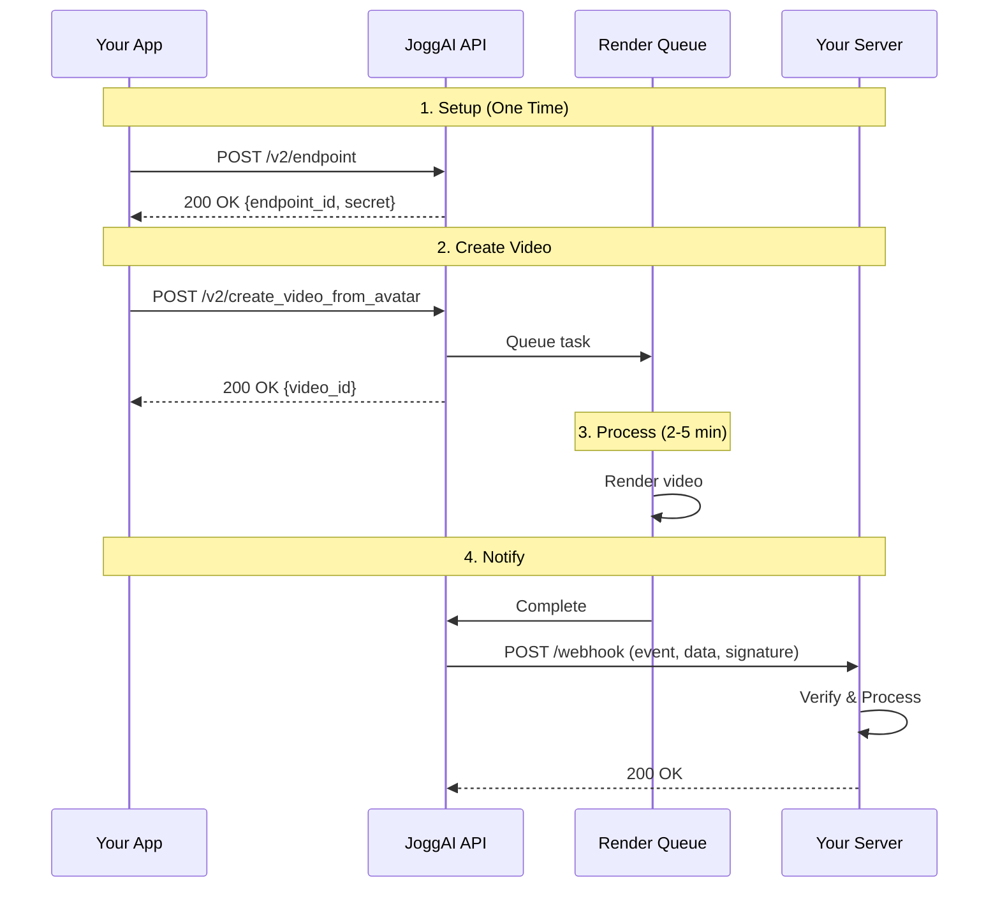

## Overview

JoggAI sends HTTP POST requests to your webhook endpoint when events occur (like video completion). This eliminates the need for polling and provides instant notifications.

<Info>
**Webhook Limit**: Each user can create up to **20** webhook endpoints.
</Info>

<CardGroup cols={2}>
  <Card title="Real-Time Updates" icon="bolt">
    Get notified instantly when videos complete
  </Card>
  <Card title="Reduced API Calls" icon="arrows-down-to-line">
    No need to poll for status
  </Card>
  <Card title="Better UX" icon="face-smile">
    Respond to events immediately
  </Card>
  <Card title="Scalable" icon="chart-line">
    Handle high volumes efficiently
  </Card>
</CardGroup>

## Workflow Overview



<Info>
  Webhook requests expect a `200 OK` response within **5 seconds**. Non-2xx responses trigger automatic retries.
</Info>

## Quick Start

### Step 1: Add Webhook Endpoint

```bash
curl --location --request POST 'https://api.jogg.ai/v2/endpoint' \
  --header 'x-api-key: YOUR_API_KEY' \
  --header 'Content-Type: application/json' \
  --data-raw '{
    "url": "https://example.com/webhook",
    "events": ["generated_avatar_video_success", "generated_avatar_video_failed"],
    "status": "enabled"
  }'
```

**Response:**

```json
{
  "code": 0,
  "msg": "Success",
  "data": {
    "endpoint_id": "wh_123456789",
    "url": "https://example.com/webhook",
    "secret": "whsec_abc123xyz",
    "status": "enabled",
    "events": ["generated_avatar_video_success", "generated_avatar_video_failed"],
    "username": "johndoe",
    "created_at": 1732806631
  }
}
```

<Check>
  Save the `secret` - you'll use it to verify webhook authenticity!
</Check>

### Step 2: Verify Webhook Signature

Always verify that webhooks come from JoggAI:

<AccordionGroup>
  <Accordion title="Go">
```go
func VerifyWebhookSignature(payload []byte, signature, secret string) bool {
    mac := hmac.New(sha256.New, []byte(secret))
    mac.Write(payload)
    expectedSignature := hex.EncodeToString(mac.Sum(nil))
    return hmac.Equal([]byte(signature), []byte(expectedSignature))
}
```
  </Accordion>
  
  <Accordion title="Python">
```python
import hmac
import hashlib

def verify_webhook_signature(payload, signature, secret):
    expected = hmac.new(
        secret.encode('utf-8'),
        payload,
        hashlib.sha256
    ).hexdigest()
    return hmac.compare_digest(signature, expected)
```
  </Accordion>
  
  <Accordion title="Node.js">
```javascript
const crypto = require('crypto');

function verifyWebhookSignature(payload, signature, secret) {
    const expected = crypto
        .createHmac('sha256', secret)
        .update(payload)
        .digest('hex');
    return crypto.timingSafeEqual(
        Buffer.from(signature),
        Buffer.from(expected)
    );
}
```
  </Accordion>
  
  <Accordion title="Bash">
```bash
verify_webhook() {
  local payload="$1"
  local signature="$2"
  local secret="$3"
  
  expected=$(echo -n "$payload" | openssl dgst -sha256 -hmac "$secret" | awk '{print $2}')
  
  if [ "$signature" = "$expected" ]; then
    echo "✅ Signature verified"
    return 0
  else
    echo "❌ Invalid signature"
    return 1
  fi
}
```
  </Accordion>
</AccordionGroup>

## Webhook Events

### Available Events

| Event | Description | When Triggered |
|-------|-------------|----------------|
| `generated_avatar_video_success` | Avatar video generation succeeded | Video is ready to download |
| `generated_avatar_video_failed` | Avatar video generation failed | An error occurred during generation |
| `generated_product_video_success` | Product video generation succeeded | Video is ready to download |
| `generated_product_video_failed` | Product video generation failed | An error occurred during generation |
| `generated_template_video_success` | Template video generation succeeded | Video is ready to download |
| `generated_template_video_failed` | Template video generation failed | An error occurred during generation |
| `generated_translate_video_success` | Video translation succeeded | Translated video is ready |
| `generated_translate_video_failed` | Video translation failed | An error occurred during translation |
| `generated_photo_avatar_success` | Photo avatar creation succeeded | Avatar is ready to use |
| `generated_photo_avatar_failed` | Photo avatar creation failed | An error occurred during avatar creation |
| `generated_script_success` | AI script generation succeeded | Scripts are ready to use |
| `generated_script_failed` | AI script generation failed | An error occurred during script generation |

<Tip>
查看 [List Webhook Events](/api-reference/v2/Webhook/ListWebhookEvents) 获取完整的事件列表。
</Tip>

### Event Payloads

<AccordionGroup>
  <Accordion title="Video Generation Success">
```json
{
  "event_id": "evt_123456789",
  "event": "generated_avatar_video_success",
  "timestamp": 1732806631,
  "data": {
    "video_id": "video_123456",
    "status": "completed",
    "video_url": "https://res.jogg.ai/video.mp4",
    "cover_url": "https://res.jogg.ai/cover.jpg",
    "duration": 30
  }
}
```
  </Accordion>
  
  <Accordion title="Video Generation Failed">
```json
{
  "event_id": "evt_123456789",
  "event": "generated_avatar_video_failed",
  "timestamp": 1732806631,
  "data": {
    "video_id": "video_123456",
    "status": "failed",
    "error": {
      "code": 50000,
      "message": "Video generation failed"
    }
  }
}
```
  </Accordion>
  
  <Accordion title="Avatar Creation Success">
```json
{
  "event_id": "evt_987654321",
  "event": "generated_photo_avatar_success",
  "timestamp": 1732806631,
  "data": {
    "avatar_id": 123,
    "status": "completed",
    "preview_url": "https://res.jogg.ai/avatar-preview.mp4",
    "cover_url": "https://res.jogg.ai/avatar-cover.jpg"
  }
}
```
  </Accordion>
</AccordionGroup>

## Managing Webhooks

<AccordionGroup>
  <Accordion title="List All Webhooks">
```bash
curl --request GET 'https://api.jogg.ai/v2/endpoints' \
  --header 'x-api-key: YOUR_API_KEY'
```

Response includes all configured webhook endpoints with their settings.

查看详情：[List Webhook Endpoints](/api-reference/v2/Webhook/ListWebhookEndpoints)
  </Accordion>
  
  <Accordion title="Update Webhook">
```bash
curl --request PUT 'https://api.jogg.ai/v2/endpoint/wh_123456789' \
  --header 'x-api-key: YOUR_API_KEY' \
  --header 'Content-Type: application/json' \
  --data-raw '{
    "url": "https://new-url.com/webhook",
    "events": ["generated_avatar_video_success", "generated_avatar_video_failed", "generated_photo_avatar_success"],
    "status": "enabled"
  }'
```

Note: The `secret` cannot be modified.

查看详情：[Update Webhook Endpoint](/api-reference/v2/Webhook/UpdateWebhookEndpoint)
  </Accordion>
  
  <Accordion title="Delete Webhook">
```bash
curl --request DELETE 'https://api.jogg.ai/v2/endpoint/wh_123456789' \
  --header 'x-api-key: YOUR_API_KEY'
```

查看详情：[Delete Webhook Endpoint](/api-reference/v2/Webhook/DeleteWebhookEndpoint)
  </Accordion>
  
  <Accordion title="List Available Events">
```bash
curl --request GET 'https://api.jogg.ai/v2/events' \
  --header 'x-api-key: YOUR_API_KEY'
```

Returns list of all supported webhook events.

查看详情：[List Webhook Events](/api-reference/v2/Webhook/ListWebhookEvents)
  </Accordion>
</AccordionGroup>

## Security Requirements

### Request Headers

```bash
POST /webhook HTTP/1.1
Host: your-domain.com
Content-Type: application/json
X-Webhook-Event: generated_avatar_video_success
X-Webhook-Signature: 7256c87be255861cbbe92f4a04a4500176b045a287f258e32e5b6c6b96d7f290
User-Agent: JoggAI-Webhook/2.0
```

### Security Checklist

- ✅ All webhook URLs must use HTTPS
- ✅ Verify `X-Webhook-Signature` header on every request
- ✅ Use HMAC SHA-256 with your secret key
- ✅ Signature is computed on raw request body
- ✅ Use constant-time comparison to prevent timing attacks
- ✅ Keep webhook secret secure (environment variables)
- ✅ Rotate secrets periodically

<Warning>
  Always verify signatures before processing webhooks. Reject requests with invalid signatures and log suspicious attempts.
</Warning>


## Related Documentation

<CardGroup cols={2}>
  <Card
    title="Create Avatar Videos"
    icon="user"
    href="/api-reference/v2/API Documentation/CreateAvatarVideos"
  >
    Set up video creation with webhooks
  </Card>
  
  <Card
    title="Product Video Workflow"
    icon="shopping-bag"
    href="/api-reference/v2/API Documentation/URLtoVideo"
  >
    Use webhooks for product videos
  </Card>
  
  <Card
    title="Webhook API Reference"
    icon="code"
    href="/api-reference/v2/Webhook/ListWebhookEndpoints"
  >
    Detailed webhook API documentation
  </Card>
</CardGroup>

